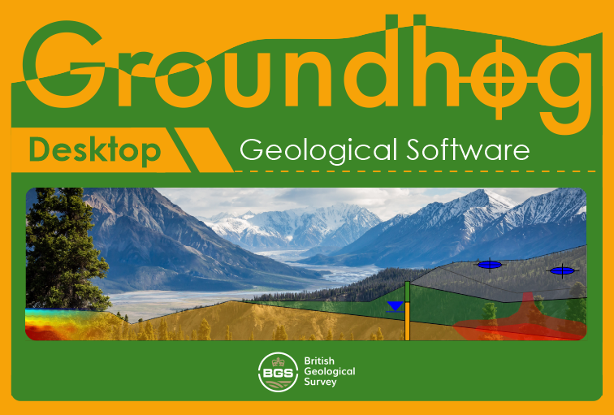

*BGS Groundhog Desktop*

User Guide v2.3.0 (BETA)

June 2021

**© Copyright British Geological Survey (UKRI) 2021. All rights
reserved.**

This document is intended as a general guide to the operation of the BGS
Groundhog Desktop software (Groundhog) and no warranty is given as to
the completeness or accuracy of the information contained within. The
contents of this document are subject to change without notice.

Except for any third-party images and content, logos or other corporate
branding materials, this document is licensed under the UK Open
Government License.

<http://www.nationalarchives.gov.uk/doc/open-government-licence/version/3/>

Topographic basemap images used within this user guide use OS open data
layers. Contains OS Data © Crown Copyright and Database Right.

**Versions**

BGS Groundhog Desktop (Groundhog) is available in two versions badged
(1) ***Community*** and (2) ***Professional***. Community is free-to-use
under the UK Open Government Licence. Professional has extended features
for building conceptual and 3D site and geological models and is
available under a commercial license via our UK commercial reseller,
Land Quality Management Ltd. (LQM).

**Contact Information**

BGS Groundhog Desktop (Groundhog) is software created and maintained by
the British Geological Survey. Further information about the development
project, and the software download, can be found on our website.

[www.bgs.ac.uk/groundhog](http://www.bgs.ac.uk/groundhog)

For general enquiries about the Groundhog project, please email us.

<groundhog@bgs.ac.uk>

**Distribution**

Licenses for Groundhog Professional, including free trial licenses, are
available via our commercial reseller, Land Quality Management Ltd.
(LQM). Further information can be obtained via their website.

<https://www.lqm.co.uk/csm/>

<judith@lqm.co.uk>

