*BGS Groundhog Desktop*

User Guide v2.0.0 (BETA)

|image0|

|image1|

**© Copyright British Geological Survey (UKRI) 2019. All rights
reserved.**

This document is intended as a general guide to the operation of the BGS
Groundhog Desktop software (Groundhog) and no warranty is given as to
the completeness or accuracy of the information contained within. The
contents of this document are subject to change without notice.

Except for any third-party images and content, logos or other corporate
branding materials, this document is licensed under the UK Open
Government License.

http://www.nationalarchives.gov.uk/doc/open-government-licence/version/3/

Topographic basemap images used within this user guide use OS open data
layers. Contains OS Data © Crown Copyright and Database Right.

**Versions**

BGS Groundhog Desktop (Groundhog) is available in two versions badged
(1) **Community** and (2) **Professional**. Community is free-to-use
under the UK Open Government Licence. Professional has extended features
for building conceptual and 3D site and geological models and is
available under a commercial license via our UK commercial reseller,
Land Quality Management Ltd. (LQM).

**Contact Information**

BGS Groundhog Desktop (Groundhog) is software created and maintained by
the British Geological Survey. Further information about the development
project, and the software download, can be found on our website.

`www.bgs.ac.uk/groundhog <http://www.bgs.ac.uk/groundhog>`__

For general enquiries about the Groundhog project, please email us.

groundhog@bgs.ac.uk

**Distribution**

Licenses for Groundhog Professional are distributed by Land Quality
Management Ltd. (LQM). Further information can be obtained via their
website.

`www.lqm.co.uk <http://www.lqm.co.uk>`__

judith.nathanail@lqm.co.uk

|image2|\ |image3|

Contents
========

`Introduction 6 <#_Toc29277861>`__

`About Groundhog 7 <#about-groundhog>`__

`Installation 7 <#installation>`__

`First Use 8 <#first-use>`__

`Digital License Activation 8 <#digital-license-activation>`__

`Data Objects 10 <#data-objects>`__

`Object Tree 11 <#object-tree>`__

`Site / Project Folder 11 <#site-project-folder>`__

`Models Folder 15 <#models-folder>`__

`System Objects Folder 15 <#system-objects-folder>`__

`User Interface 17 <#user-interface>`__

`Main Panels 18 <#main-panels>`__

`Main Toolbar [1] 18 <#main-toolbar-1>`__

`Session Panel [2] 18 <#session-panel-2>`__

`Map Window [3] 19 <#map-window-3>`__

`Map Window Layer Control [4] 22 <#map-window-layer-control-4>`__

`Cross-Section Window [5] 26 <#cross-section-window-5>`__

`Cross-Section Window Layer Control [6]
28 <#cross-section-window-layer-control-6>`__

`Status Bar [7] 31 <#status-bar-7>`__

`Importing & Exporting Data 32 <#_Toc29277880>`__

`Images 33 <#images>`__

`Boreholes 36 <#boreholes>`__

`CSV/TXT Format 37 <#csvtxt-format>`__

`AGS Format 39 <#ags-format>`__

`LAS Format 41 <#las-format>`__

`BGS Borehole Records 43 <#bgs-borehole-records>`__

`Shapefiles 48 <#shapefiles>`__

`ASCII Grids 49 <#ascii-grids>`__

`Working With Borehole Logs 52 <#_Toc29277889>`__

`Borehole Data Structure 53 <#borehole-data-structure>`__

`Displaying Boreholes 55 <#displaying-boreholes>`__

`Creating Borehole Log Templates
55 <#creating-borehole-log-templates>`__

`Editing Borehole Log Templates 57 <#editing-borehole-log-templates>`__

`Editing Borehole Data 71 <#editing-borehole-data>`__

`Drawing Points, Shapes & Annotations 78 <#_Toc29277895>`__

`Creating New Layers 79 <#creating-new-layers>`__

`Creating and Editing Point Layers
79 <#creating-and-editing-point-layers>`__

`Creating & Editing Shape Layers 82 <#creating-editing-shape-layers>`__

`Creating & Editing Annotation Layers
89 <#creating-editing-annotation-layers>`__

`Drawing Cross-Sections 98 <#drawing-cross-sections>`__

`Creating the Cross-Section Alignment
99 <#creating-the-cross-section-alignment>`__

`Creating Cross-Sections Without an Alignment
99 <#creating-cross-sections-without-an-alignment>`__

`Drawing a Polyline for the Alignment
99 <#drawing-a-polyline-for-the-alignment>`__

`Including Boreholes in the Cross-Section Alignment
101 <#including-boreholes-in-the-cross-section-alignment>`__

`Modifying the Alignment 101 <#modifying-the-alignment>`__

`Viewing and Editing the Cross-Section
104 <#viewing-and-editing-the-cross-section>`__

`Topographic Profile 105 <#topographic-profile>`__

`Viewing Boreholes 106 <#viewing-boreholes>`__

`Buffering Boreholes Into a Cross-Section
108 <#buffering-boreholes-into-a-cross-section>`__

`Registering Images in Cross-Section
109 <#registering-images-in-cross-section>`__

`Drawing Geology 111 <#drawing-geology>`__

`Developing Conceptual Site Models 119 <#_Toc29277912>`__

`Introduction 120 <#introduction-1>`__

`Constructing the Data Model 120 <#constructing-the-data-model>`__

`Creating Pollutant Linkages 122 <#creating-pollutant-linkages>`__

`Displaying a Network Diagram 124 <#displaying-a-network-diagram>`__

`Drawing CSM Objects in Map and Cross-Section
127 <#drawing-csm-objects-in-map-and-cross-section>`__

`Shapes 127 <#shapes>`__

`Annotations 128 <#annotations>`__

`Drawing Water Levels and Defining Aquifers
129 <#drawing-water-levels-and-defining-aquifers>`__

`Accessing Historic Maps 133 <#accessing-historic-maps>`__

`Building Geological Models 136 <#_Toc29277922>`__

`Intro 137 <#intro>`__

`Defining the Model Grid 137 <#defining-the-model-grid>`__

`Creating Model Layers 139 <#creating-model-layers>`__

`3D Graphics 160 <#_Toc29277926>`__

`Intro 161 <#intro-1>`__

`The initial interface 161 <#the-initial-interface>`__

`Start-up widgets 162 <#start-up-widgets>`__

`Controls 163 <#controls>`__

`Adding layers (the layer control)
165 <#adding-layers-the-layer-control>`__

`Clipping Options 167 <#clipping-options>`__

`Models 169 <#models>`__

`Model Options 169 <#model-options>`__

`Model Caching 170 <#model-caching>`__

Introduction
============

This section provides an overview of Groundhog and information about how
to install the software and activate a license.

|image4|

*Photo by Hosea Georgeson on Unsplash*

About Groundhog
---------------

BGS Groundhog Desktop (Groundhog) is geological software created and
maintained by a team at the British Geological Survey. It is available
in two versions, (1) **Community** and (2) **Professional**.

**Community** is free-to-use, including for commercial applications,
under the UK Open Government Licence. You can use it to import and
explore your site geological data such as maps and boreholes. It allows
you to create custom borehole log templates, develop map line-work and
draw geological cross-sections.

**Professional** includes all of the features of Community and adds a
range of modelling capability. Use it to create annotated, conceptual
site models. You can also use it to develop full 3D geological framework
models. Professional requires a digital activation key which is
available from our commercial reseller, Land Quality Management
`www.lqm.co.uk <http://www.lqm.co.uk>`__

This user guide covers both versions. Please note that not all features
described here are available in all versions of the software. Where a
particular feature relates only to the Groundhog Professional version it
will be highlighted like this:

*Professional*

Groundhog is currently BETA software and not all of the available
features of Groundhog are necessarily documented in this guide. Whilst
considerable effort has gone into its design and testing, please be
aware that the software is still in very active development and may not
be completely stable in all situations. We are very happy to receive
feedback from users by email groundhog@bgs.ac.uk

A basic set of tutorial videos is available at;

https://www.youtube.com/channel/UCQc4rWxP2sMPNFhHq6xOthQ/videos

Installation
------------

**Please read all steps carefully to ensure correct installation of
Groundhog!**

You can obtain the installer for Groundhog from the BGS website. There
is only one installer, you do not need a separate installer for
Community and Professional because the two versions are controlled by
the digital license which is available from Land Quality Management.

`www.bgs.ac.uk/groundhog <http://www.bgs.ac.uk/groundhog>`__

`www.lqm.co.uk <http://www.lqm.co.uk>`__

Groundhog can only be installed on Windows computers. There are no
specific minimum system requirements to run Groundhog, but you may find
the 3D graphics capability performs better on a computer with a
dedicated graphics card.

**IMPORTANT:** Before you begin the install you must create a workspace
folder for Groundhog. This is where Groundhog will store configuration
information and project data. You will need it during the install and
you must make sure that the folder you create for this **is not** in any
special Windows system folders such as C:\Program Files or C:\Windows,
so make sure to place it in a normal files area where you have
permission to create and edit files. You can place this folder on a
network drive if you like, but be aware that Groundhog will stop working
if your connection to the drive becomes unavailable, so it is best to
use a local folder.

The download is in ZIP archive format which contains an installer
executable (setup.exe). Extract the contents of the ZIP file to a
temporary location.

<Right-click> on the <setup.exe> file and choose <Run as administrator>

**IMPORTANT:** Depending on your organisation’s security policies you
may need assistance from your IT support department to carry out the
software install.

The installation wizard guides you through a series of screens.

You will be prompted to choose an **installation folder**, which is
usually C:\Program Files\BGS Groundhog Desktop, but you can install
Groundhog wherever you prefer.

**IMPORTANT:** You will also be prompted to choose a **working folder**
for Groundhog called the workspace. **This is not the same as the
installation folder**. It is **VERY IMPORTANT** that you choose the
workspace folder that you created in the previous step described above,
otherwise Groundhog will not function correctly. This is because
Groundhog writes configuration information to that folder and Windows
will block this operation if you try to use the installation folder for
this purpose.

First Use
---------

Each time you start Groundhog you will see a screen like this.

|image5|

This screen is prompting you to choose a specific workspace folder for
the session configuration. Whilst it is possible to configure multiple
different workspaces it is best to begin by just using the DEFAULT
workspace.

So, when you see this screen, just click <OK>

Digital License Activation
--------------------------

Groundhog will automatically run in Community mode right away. There is
no need to activate this version in any way. You can get started using
it immediately and use it for as long as you like. We do humbly request
that you consider acknowledging your use of Groundhog in your projects
because this helps our project gain exposure, but you do not have to!

If you are upgrading to the Professional version of Groundhog you will
need a digital activation key. Keys can be obtained from our commercial
reseller, Land Quality Management Ltd.

`www.lqm.co.uk <http://www.lqm.co.uk>`__

When you purchase your digital license for Groundhog Professional you
will be asked for your email address. This information is only used for
the purposes of generating a unique digital key and is not stored
anywhere except on your own computer as part of the procedure.

By return you will receive an email containing a digital license
activation key. Start Groundhog and select <Help> <Licensing> <Activate
Professional Edition> from the main menu button.

|image6|

When prompted, enter your email address and the digital key you
received. **IMPORTANT:** The email address you enter is case-sensitive.

|image7|

Once activated you will need to re-start Groundhog to switch to
Professional mode. From now on, Groundhog will run in Professional mode
for the duration of you license.

If you experience any difficulties with your activation, please contact
the person who issued your digital key by email.

Data Objects
============

This section provides an overview of the key data object types supported
by Groundhog, where they are held in the project structure and how to
both create and import your own data structures into a Groundhog
project.

|image8|

*Photo by João Silas on Unsplash*

Object Tree
-----------

Project data is held as various objects within the object tree. The
object tree is found along the left side of the main user interface
under the <Workspace> tab. For more details on the other components of
the user interface please refer to the next main section of the user
guide.

|image9|

This tree panel is a typical multi-level object structure, like a
Windows file explorer navigation panel. Expand the various folder nodes
to explore your data at different levels. Note that not all folder nodes
are available in all versions of Groundhog.

The object tree is arranged into three top-level folders.

|image10|

Site / Project Folder
~~~~~~~~~~~~~~~~~~~~~

Contains the key site investigation data types such as GIS-style point
and shape layers, borehole data, cross-sections, project phase and CSM
information, annotations and linked files such as images.

|image11|

Location Layers Folder
^^^^^^^^^^^^^^^^^^^^^^

This folder holds both GIS-style point layers and also borehole dataset
layers. Borehole layers are effectively treated as a special flavour of
point layer, which is why they are grouped together as Location Layers.

Make new, empty layers using <right-click> <New Layer>.

|image12|

Enter a name.

|image13|

Click <Yes> if you want to make a layer for boreholes, click <No> to
make a layer for point data.

|image14|

This is the effect of doing both a borehole layer and a point layer.
Note the different icons.

|image15|

In the case of boreholes, a <Right-Click> option allows for data import.
For more details on data import see the main user guide chapter
**Importing & Exporting Data**.

|image16|

Shape Layers Folder
^^^^^^^^^^^^^^^^^^^

This folder holds GIS-style shape layers (lines and polygons). Groundhog
makes no distinction between lines and polygons, so they are grouped
together into generic shape layers.

Make new, empty layers using <right-click> <New Layer>

|image17|

Enter a name.

|image18|

Empty layer is added to the folder.

|image19|

Cross-Sections Folder
^^^^^^^^^^^^^^^^^^^^^

This is where drawn cross-sections will appear. At the moment, Groundhog
stores all of these in a single folder. Typically you will create new
cross-sections by drawing them in the map – please refer to the
**Drawing Cross-Sections** chapter of the user guide for more
information. However, it is possible to create non-spatially referenced
cross-section objects directly from the tree if you just want to draw a
cross-section without placing it in the map context via <right-click>
<Tools> <Create New Cross-Section>.

|image20|

Enter a name.

|image21|

Specify a length in metres.

|image22|

|image23|

Cross-sections created in this way are all registered starting at [0, 0]
grid coordinates.

Annotations Folder
^^^^^^^^^^^^^^^^^^

Annotations layers hold labels, callouts and graphics icons to label and
represent objects within the project or the conceptual site model.
Create a new layer for holding annotation objects via <Right-Click> <New
Layer>.

*Professional*

|image24|

Enter a name.

|image25|

|image26|

Annotation layers can be created and edited in Professional mode and
viewed in Community mode.

Phases Folder
^^^^^^^^^^^^^

The phases folder is specific to developing conceptual site models
(CSMs) in Groundhog. For more details please refer to the **Developing
Conceptual Site Models** chapter of the user guide. Phases hold the
structure for the CSM, allowing multiple CSMs to be developed and
related back to different phases of a project or site development.
Create a new layer for holding annotation objects via <Right-Click> <New
Phase>.

*Professional*

|image27|

Associated Files Folder
^^^^^^^^^^^^^^^^^^^^^^^

Certain types of imported file will appear in this folder when they are
imported. A good example is imported image files which have their own
specific sub-folder.

|image28|

Models Folder
~~~~~~~~~~~~~

Contains the key data types related to 2.5D and 3D models and related
information.

|image29|

Layer Models Folder
^^^^^^^^^^^^^^^^^^^

This folder holds layer-based 3D geological models as well as other
types of more 2.5D models such as surface or gridded property models
such as water levels or chemical concentration maps. In Community mode
this folder will display the available models in an existing project. In
Professional mode you are able to create new models and edit existing
models. Creating models is an in-depth topic. Please refer to the
chapter on **Building Geological Models** in this user guide for more
information.

*Professional*

Reference Grids Folder
^^^^^^^^^^^^^^^^^^^^^^

This folder holds any loaded grid layers. Typically, these are imported
from ESRI ASCII grid format. Examples include DEM or DTM layers that you
wish to use as topographic profiles for cross-section drawing and for
acting as the topographic cap of 3D geological models. You can also
bring in other layers such as water levels and engineering layers and
display these in various ways within the software. For more information
on how to get grid data into Groundhog workspaces and projects please
refer to the Importing and Exporting Data section of this user guide.

Modelled Objects Folder
^^^^^^^^^^^^^^^^^^^^^^^

This folder can be used to hold reference 3D objects such as models of
infrastructure and buildings and other site objects. These objects can
then be visualized using the 3D graphics window. Typically, such objects
are imported from an OBJ file. Note that OBJ files can only be viewed
using the 3D graphics window in Groundhog.

System Objects Folder
~~~~~~~~~~~~~~~~~~~~~

This folder stores system-level objects which are typically available
across all of your Groundhog projects.

|image30|

Pick Lists Folder
^^^^^^^^^^^^^^^^^

This folder holds pick list or dictionary objects. These are pre-set
lists of values and descriptions that are used in various places within
Groundhog to perform lookups. Although you can define your own pick
lists, typically you do not need to interact with this folder in the
current version of Groundhog. Examples include a pick list of possible
contaminants for conceptual site models, or dictionary lookups for
geotechnical data in AGS format.

|image31|

|image32|

Templates Folder
^^^^^^^^^^^^^^^^

This folder holds borehole log templates. When Groundhog is first
installed it will only contain a couple of default templates. You can
add your own blank Template objects and then design them using the log
window. For more information on how to design your own log templates
please refer to the **Working With Borehole Logs** chapter of this user
guide.

To make a new template use <right-click> <New Template>.

|image33|

Enter a name.

|image34|

The new template is added to the folder and is ready to be worked on.

|image35|

Web Map Services Folder
^^^^^^^^^^^^^^^^^^^^^^^

This folder lists the available Web Map Services (WMS) in the workspace.
Groundhog comes pre-loaded with BGS WMS layers and these will always be
listed here, so long as Groundhog was able to load them at start up
(requires an internet connection). Typically you will not interact with
the object in this folder directly, but you will be able to add them as
layers to map window.

User Interface
==============

This section provides an overview of the graphical user interface and
key panels and buttons within Groundhog.

|image36|

*Original photo by Kobu Agency on Unsplash*

Main Panels
-----------

The Groundhog user interface is arranged into a number of panels
containing data objects and graphics. Because Groundhog is a highly
interactive graphical tool you will benefit significantly from using a
good-quality mouse equipped with a mouse wheel – a laptop track-pad is
not a good match with Groundhog.

|image37|

Main Toolbar **[1]**
~~~~~~~~~~~~~~~~~~~~

Contains high-level buttons for key operations.

+-----------+-----------------+--------------------------------------+
| |image48| | Main Menu       | This is the main menu button         |
|           |                 | providing access to a series of      |
|           |                 | high-level functions such as         |
|           |                 | import/export.                       |
+===========+=================+======================================+
| |image49| | Open Project    | Opens a file chooser for opening     |
|           |                 | Groundhog projects in the \*.gop     |
|           |                 | file format.                         |
+-----------+-----------------+--------------------------------------+
| |image50| | Save Project    | Opens a file chooser for saving the  |
|           |                 | current session to a Groundhog       |
|           |                 | \*.gop file format.                  |
+-----------+-----------------+--------------------------------------+
| |image51| | Open Map Window | Allows the creation of a new map     |
|           |                 | (plan-view) window. When you create  |
|           |                 | a new map window you will be         |
|           |                 | prompted to select the data layers   |
|           |                 | you want to see in the window. The   |
|           |                 | available layers will depend on the  |
|           |                 | data contained within your workspace |
|           |                 | or project. Press <Skip> to open a   |
|           |                 | blank window.                        |
+-----------+-----------------+--------------------------------------+
| |image52| | Open 3D Window  | Opens the 3D graphics window.        |
+-----------+-----------------+--------------------------------------+

Session Panel **[2]**
~~~~~~~~~~~~~~~~~~~~~

A tabbed panel containing a range of session-level objects.

|image53|

Workspace
^^^^^^^^^

This contains the main Object Tree panel with a hierarchical list of all
data objects in the session. For more details please refer to the Object
Tree section of this user guide.

Library
^^^^^^^

|image54|\ A panel containing a configurable library of available
drawing codes (geology codes and other special codes). Single-click on
an entry to select it as the active drawing code – this sets the code as
active in all windows. The below example shows “BOULDERS” as the
selected drawing code. Note that the special codes “SHAPE” and “FAULT”
are always at the top, and the rest of the list is sorted
alphabetically. Type into the search box to find codes. Click <All> to
reset the list back to all values after searching.

|image55|

+-----------+--------------+-----------------------------------------+
| |image64| | Add Code     | Add a drawing code, and optionally a    |
|           |              | matching colour, to the library.        |
+===========+==============+=========================================+
| |image65| | Add Colour   | Add a colour value to the library.      |
+-----------+--------------+-----------------------------------------+
| |image66| | Save Codes   | Saves all current drawing codes to the  |
|           |              | global workspace.                       |
+-----------+--------------+-----------------------------------------+
| |image67| | Save Colours | Saves all current colour values to the  |
|           |              | global workspace.                       |
+-----------+--------------+-----------------------------------------+

Map Window **[3]**
~~~~~~~~~~~~~~~~~~

A tabbed component capable of displaying multiple map panels. Each map
panel can display map data layers and can be used for digitizing points
and shapes, constructing cross-section alignments and for placing
borehole locations.

When you create a new map window you will be prompted to select the data
layers you want to see in the map. The icons for each layer indicate the
layer’s data type. The available layers will depend on what data you
have in your workspace and project.

|image68|

The panel on the left shows data layers in the session and the panel on
the right typically displays any web map services that are available.
Single-click on individual entries to select them. If you want to select
multiple layers hold the CTRL key, or to select a range of layer hold
the SHIFT key, as-per typical list controls in Windows programs.

Some layers are ALWAYS available, including **Cross-Sections** (the
default cross-sections folder) and **Graticule** (a grid overlay with
scale bar and north arrow).

When you save your project it will store the configuration and scale of
all opened map windows ready for your next session.

When you are working in the map view, if you are working in the UK it is
a good idea to always add the default **Topographic Basemap** layer that
is included with Groundhog for orientation purposes. Otherwise, you may
wish to import a geo-registered image of your site/project area for the
same purpose.

General Navigation
^^^^^^^^^^^^^^^^^^

Each graphics panel works like most interactive online map applications.
The mouse is inherently multi-mode, reducing the need to constantly
select different tools to pan and zoom. Click and hold mouse button 1
(typically the left button) and drag the mouse to pan the map around.
Use the mouse wheel to zoom in and out (a good mouse wheel is very
important for effective Groundhog operation). The mouse zoom is
dynamically targeted to the mouse cursor position, allowing for very
rapid and precise zoom in from small scale to large scale maps.

Certain types of object such as cross-sections and boreholes can be
previewed or queried by holding down the SHIFT key whilst hovering over
the object. Here is an example of hovering over a cross-section
alignment whilst holding the SHIFT key.

|image69|

Toolbar
^^^^^^^

|image70|

+-----------+---------------------+----------------------------------+
| |image91| | Zoom To Extent      | Zooms to the full extent of all  |
|           |                     | layers in the map panel, or to   |
|           |                     | the currently active layer, if   |
|           |                     | one is selected.                 |
+===========+=====================+==================================+
| |image92| | Zoom In             | Incrementally zooms the map to a |
|           |                     | larger scale with each           |
|           |                     | successive click.                |
+-----------+---------------------+----------------------------------+
| |image93| | Zoom Out            | Incrementally zooms the map to a |
|           |                     | smaller scale with each          |
|           |                     | successive click.                |
+-----------+---------------------+----------------------------------+
| |image94| | Gazetteer           | Search for places (UK only) by   |
|           |                     | place name, street+placement or  |
|           |                     | county. Examples:                |
|           |                     |                                  |
|           |                     | “Nottingham”                     |
|           |                     |                                  |
|           |                     | “Main Street, Keyworth”          |
|           |                     |                                  |
|           |                     | “Rutland”                        |
+-----------+---------------------+----------------------------------+
| |image95| | Select Drawing Code | Click to open the drawing code   |
|           |                     | library panel in order to change |
|           |                     | the active drawing code. Also    |
|           |                     | displays the currently active    |
|           |                     | drawing code, including its      |
|           |                     | colour and ornament if they are  |
|           |                     | available.                       |
+-----------+---------------------+----------------------------------+
| |image96| | Print               | Send the current map view to a   |
|           |                     | printer.                         |
+-----------+---------------------+----------------------------------+
| |image97| | Save Image          | Save the current map view to an  |
|           |                     | image (JPEG or PNG).             |
+-----------+---------------------+----------------------------------+
| |image98| | Save PDF            | Save the current map view to a   |
|           |                     | PDF document.                    |
+-----------+---------------------+----------------------------------+
| |image99| | Toggle Slider       | The layer slider allows partial  |
|           |                     | view of a user-defined           |
|           |                     | collection of map data layers    |
|           |                     | for rapid comparison. With the   |
|           |                     | slider toggled on, use the mouse |
|           |                     | to drag the slider position in   |
|           |                     | the map panel. The below example |
|           |                     | shows the BGS geology map WMS    |
|           |                     | active as the active slider      |
|           |                     | layer on top of a topographic    |
|           |                     | basemap. For information about   |
|           |                     | how to make a particular layer   |
|           |                     | active in the slider refer to    |
|           |                     | the section on the Map Window    |
|           |                     | Layer Control below.             |
|           |                     |                                  |
|           |                     | |image100|                       |
+-----------+---------------------+----------------------------------+

Right-Click Operations
^^^^^^^^^^^^^^^^^^^^^^

The map panel supports a number of context-sensitive right-click
operations. These will depend on whether you are right-clicking on a
specific data object such as a cross-section alignment or a point
object, or whether you are in a “whitespace” area (a non-specific
portion of the panel). In general, a “whitespace” click will present the
following options.

|image101|

+--------------------+------------------------------------------------+
| Centre The Map     | Enter a [X, Y] coordinate to centre the map at |
|                    | a specific location.                           |
+====================+================================================+
| Set Map Scale      | Enter a value to zoom the map to an            |
|                    | approximate scale. For example, enter “10000”  |
|                    | to scale to 1:10k. Note that the exact scaling |
|                    | is dependent on screen resolution.             |
+--------------------+------------------------------------------------+
| Find A Place       | (Gazetteer) Search for places (UK only) by     |
|                    | place name, street+place name or county.       |
|                    | Examples:                                      |
|                    |                                                |
|                    | “Nottingham”                                   |
|                    |                                                |
|                    | “Main Street, Keyworth”                        |
|                    |                                                |
|                    | “Rutland”                                      |
+--------------------+------------------------------------------------+
| Show Grid Info     | Show UK grid reference for the mouse cursor    |
|                    | position, e.g. |image104|                      |
+--------------------+------------------------------------------------+
| Site Investigation | Currently contains one option to hyperlink out |
|                    | to the historic map(s) available from the NLS  |
|                    | for the clicked-on location. For more          |
|                    | information please refer to the main section   |
|                    | on developing conceptual site models.          |
+--------------------+------------------------------------------------+

Map Window Layer Control **[4]**
~~~~~~~~~~~~~~~~~~~~~~~~~~~~~~~~

When you create a new map window you will be prompted to select which
data layers you want to add to the window. You can add layers layer on
too. The layers you choose will be added to this layer control panel.
The panel also has its own toolbar.

.. _toolbar-1:

Toolbar
^^^^^^^

|image105|

+------------+-------------------+-----------------------------------+
| |image118| | Add Layers        | Opens a list of available layers  |
|            |                   | that can be added to the map.     |
|            |                   | Note that the list does not       |
|            |                   | present layers which are already  |
|            |                   | in the map.                       |
+============+===================+===================================+
| |image119| | Undo              | Undo on the last operation.       |
|            |                   | **IMPORTANT:** please note that   |
|            |                   | the undo only becomes active when |
|            |                   | a data layer is made active –     |
|            |                   | i.e., the undo is layer-specific. |
+------------+-------------------+-----------------------------------+
| |image120| | Redo              | Redo on the last operation.       |
|            |                   | **IMPORTANT:** please note that   |
|            |                   | the redo only becomes active when |
|            |                   | a data layer is made active –     |
|            |                   | i.e., the redo is layer-specific. |
+------------+-------------------+-----------------------------------+
| |image121| | Remove All Layers | Clears the map of all data        |
|            |                   | layers.                           |
+------------+-------------------+-----------------------------------+
| |image122| | Window Settings   | Access high-level settings for    |
|            |                   | the map window.                   |
+------------+-------------------+-----------------------------------+
| |image123| | Background Colour | Change the background colour of   |
|            |                   | the map panel. This can be useful |
|            |                   | for improving clarity of certain  |
|            |                   | types of data.                    |
+------------+-------------------+-----------------------------------+

Layers
^^^^^^

The layers panel lists all currently loaded layers within the map
window. Different map windows can have different layers loaded.

|image124|

Checking the main tick-box on and off controls the visibility of each
layer. In the example below, **Topographic Basemap** is not visible in
the map panel, and **Graticule** is.

|image125|

The slider controls under the name of each layer control the
transparency of the layers. Slide the bar all the way to the left to
make the layer completely transparent. Slide the bar all the way to the
right to make the layer completely opaque.

|image126|

Single-click on a layer to make it the active layer. Depending on the
layer type this may activate drawing/editing tools, query tools, or it
may do nothing. When a layer is active it displays in orange. Only one
layer can be active at a time. Single-click on the active layer to
de-activate it. The example below shows the Cross-Sections layer as
active.

|image127|

The order of the layers in the panel dictates the drawing order in the
map panel. The layer at the top of the list will be drawn as the top
layer in the map graphics panel. The exception to this is that the
active layer is always drawn on top of everything else.

To change the drawing order of a layer, single-click and hold on the
layer, and drag it to re-position it in the list. In the example below,
the Cross-Sections layer is being dragged upwards.

|image128|

Each layer has four buttons on the right-hand side of its row.

|image129|

+----------------------+---------------------+----------------------+
| |image140|           | Settings            | Access               |
|                      |                     | layer-specific       |
|                      |                     | settings.            |
+======================+=====================+======================+
| |image141|           | Toggle Slider Layer | Toggles the layer in |
| |image142|           |                     | and out of the       |
|                      |                     | active slider layer  |
|                      |                     | (see above for       |
|                      |                     | information about    |
|                      |                     | the slider           |
|                      |                     | controls). When the  |
|                      |                     | toggle button is     |
|                      |                     | orange it means the  |
|                      |                     | layer is active in   |
|                      |                     | the slider.          |
+----------------------+---------------------+----------------------+
| |image143|           | Filter              | At the moment this   |
|                      |                     | button is disabled   |
|                      |                     | for all layers       |
|                      |                     | pending future       |
|                      |                     | filtering            |
|                      |                     | capability.          |
+----------------------+---------------------+----------------------+
| |image144|           | Remove              | Removes the layer    |
|                      |                     | from the current     |
|                      |                     | window (does **not** |
|                      |                     | delete the layer     |
|                      |                     | from the project!)   |
+----------------------+---------------------+----------------------+

There are a number of operations available by right-clicking in any
blank or “whitespace” portion of the layer control.

|image145|

These allow for the creation of new data layers directly in the map, but
(depending on version) are currently restricted to Point, Borehole,
Shape and Annotation*.

\* *Professional*

Active Layer: Draw, Edit & Identify
^^^^^^^^^^^^^^^^^^^^^^^^^^^^^^^^^^^

Depending on the type of the layer certain editing, drawing and querying
operations may be available on the active map layer. When a layer can be
edited or drawn into it typically presents a tool palette in the map
graphics panel when the layer becomes active. The example below shows
the palette which has appeared in the top-left of the map panel by
making a shape layer active in the layer control.

|image146|

You can move the palette around in the map panel by dragging the green
bar along the top of the box. Note that the palette becomes less
transparent when the mouse cursor is over it.

|image147|

For more detailed information on the various tools available in the
palette, depending on the layer type, please refer to the section
**Drawing Points & Shapes** within this user guide.

When a layer is active you may see variations on the right-click option
available in the map window and also depending on whether you have
right-clicked on an object or whitespace.

Some layers have identify capability when they are active. The identify
operation is not a separate tool within groundhog – instead, with a
layer active, just single-click on an object or location. A good example
is the BGS WMS layers where the identify is active everywhere on the
geology map. If the identify query yields results they will be displayed
in the lower half of the map window layer control.

|image148|

Cross-Section Window **[5]**
~~~~~~~~~~~~~~~~~~~~~~~~~~~~

A tabbed component capable of displaying multiple cross-section panels.
Each cross-section panel can display profile data layers and can be used
for drawing geological interpretations, viewing borehole transects and
digitizing points and shapes. Unlike the map window, you can’t just
create a new, empty window. To open a section window you must open a
specific cross-section object. You can do this either by double-clicking
on its entry in the object tree, or by right-click on the section
alignment in a map window.

When you open a cross-section in the cross-section window, some data
layers are ALWAYS available, including **Terrain Profile** (the
topographic profile for the cross-section), **Geology** (for drawing a
geological interpretation), **Graticule** (a grid overlay with scale
bars) and **Boreholes** (even if there are no boreholes in the
alignment).

When you save your project it will store the configuration and scale of
all opened cross-section windows ready for your next session.

.. _general-navigation-1:

General Navigation
^^^^^^^^^^^^^^^^^^

Each graphics panel works like most interactive online map applications.
The mouse is inherently multi-mode, reducing the need to constantly
select different tools to pan and zoom. Click and hold mouse button 1
(typically the left button) and drag the mouse to pan the cross-section
around. Use the mouse wheel to zoom in and out (a good mouse wheel is
very important for effective Groundhog operation). The mouse zoom is
dynamically targeted to the mouse cursor position, allowing for very
rapid and precise zoom in from small scale to large scale views.

.. _toolbar-2:

Toolbar
^^^^^^^

|image149|

+------------+---------------------------+---------------------------+
| |image172| | Vertical Exaggeration     | Sets the vertical         |
|            |                           | exaggeration for the      |
|            |                           | panel. Contains a list of |
|            |                           | pre-set values and can    |
|            |                           | also be typed into for    |
|            |                           | custom values.            |
+============+===========================+===========================+
| |image173| | Zoom To Extent            | Zooms to the full extent  |
|            |                           | of all the cross-section. |
+------------+---------------------------+---------------------------+
| |image174| | Marquee Zoom              | Draw a box to zoom to     |
|            |                           | that area of the panel.   |
+------------+---------------------------+---------------------------+
| |image175| | Incrementally zooms the   | Incrementally zooms the   |
|            | panel to a smaller scale  | cross-section to a        |
|            | with each successive      | smaller scale with each   |
|            | click.                    | successive click.         |
+------------+---------------------------+---------------------------+
| |image176| | Refresh                   | Refreshes the graphics    |
|            |                           | panel.                    |
+------------+---------------------------+---------------------------+
| |image177| | Select Drawing Code       | Click to open the drawing |
|            |                           | code library panel in     |
|            |                           | order to change the       |
|            |                           | active drawing code. Also |
|            |                           | displays the currently    |
|            |                           | active drawing code,      |
|            |                           | including its colour and  |
|            |                           | ornament if they are      |
|            |                           | available.                |
+------------+---------------------------+---------------------------+
| |image178| | Print                     | Send the current          |
|            |                           | cross-section view to a   |
|            |                           | printer.                  |
+------------+---------------------------+---------------------------+
| |image179| | Save Image                | Save the current          |
|            |                           | cross-section view to an  |
|            |                           | image (JPEG or PNG).      |
+------------+---------------------------+---------------------------+
| |image180| | Save PDF                  | Save the current          |
|            |                           | cross-section view to a   |
|            |                           | PDF document.             |
+------------+---------------------------+---------------------------+
| |image181| | Toggle Slider             | The layer slider allows   |
|            |                           | partial view of a         |
|            |                           | user-defined collection   |
|            |                           | of cross-section data     |
|            |                           | layers for rapid          |
|            |                           | comparison. With the      |
|            |                           | slider toggled on, use    |
|            |                           | the mouse to drag the     |
|            |                           | slider position in the    |
|            |                           | graphics panel. The below |
|            |                           | example shows the Geology |
|            |                           | layer as the active       |
|            |                           | slider layer on top of a  |
|            |                           | Terrain Profile layer.    |
|            |                           | For information about how |
|            |                           | to make a particular      |
|            |                           | layer active in the       |
|            |                           | slider refer to the       |
|            |                           | section on the            |
|            |                           | Cross-Section Window      |
|            |                           | Layer Control below.      |
|            |                           |                           |
|            |                           | |image182|                |
+------------+---------------------------+---------------------------+

.. _right-click-operations-1:

Right-Click Operations
^^^^^^^^^^^^^^^^^^^^^^

The map panel supports a number of context-sensitive right-click
operations. These will depend on whether you are right-clicking on a
specific data object such as a geology line or a shape object, or
whether you are in a “whitespace” area (a non-specific portion of the
panel). In general, a “whitespace” click will present the following
options.

|image183|

+----------------------+----------------------------------------------+
| Create Line [CODE]   | Allows creation of a fixed-elevation geology |
|                      | line using the currently active drawing      |
|                      | code.                                        |
+======================+==============================================+
| New Shape Layer      | Creates a new cross-section shape layer      |
|                      | which you can draw into.                     |
+----------------------+----------------------------------------------+
| New Annotation Layer | Creates a new annotation layer which can be  |
|                      | used to add labels, arrows and graphics to   |
|                      | the cross-section.                           |
|                      |                                              |
|                      | *Professional*                               |
+----------------------+----------------------------------------------+

Cross-Section Window Layer Control **[6]**
~~~~~~~~~~~~~~~~~~~~~~~~~~~~~~~~~~~~~~~~~~

This panel lists the data layers which are currently added to the
cross-section window. The panel also has its own toolbar.

.. _toolbar-3:

Toolbar
^^^^^^^

|image184|

+------------+-------------------+-----------------------------------+
| |image195| | Add Layers        | Opens a list of available layers  |
|            |                   | that can be added to the window.  |
|            |                   | Note that the list does not       |
|            |                   | present layers which are already  |
|            |                   | in the list.                      |
+============+===================+===================================+
| |image196| | Undo              | Undo on the last operation.       |
|            |                   | **IMPORTANT:** please note that   |
|            |                   | the undo is global across all     |
|            |                   | layers.                           |
+------------+-------------------+-----------------------------------+
| |image197| | Redo              | Redo on the last operation.       |
|            |                   | **IMPORTANT:** please note that   |
|            |                   | the redo is global across all     |
|            |                   | layers.                           |
+------------+-------------------+-----------------------------------+
| |image198| | Window Settings   | Access high-level settings for    |
|            |                   | the cross-section window.         |
+------------+-------------------+-----------------------------------+
| |image199| | Background Colour | Change the background colour of   |
|            |                   | the graphics panel. This can be   |
|            |                   | useful for improving clarity of   |
|            |                   | certain types of data.            |
+------------+-------------------+-----------------------------------+

.. _layers-1:

Layers
^^^^^^

The layers panel lists all currently loaded layers within the
cross-section window. Different windows can have different layers
loaded.

|image200|

Checking the main tick-box on and off controls the visibility of each
layer. In the example below, **Terrain Profile** is not visible in the
section panel, and **Graticule** is.

|image201|

The slider controls under the name of each layer control the
transparency of the layers. Slide the bar all the way to the left to
make the layer completely transparent. Slide the bar all the way to the
right to make the layer completely opaque.

|image202|

Single-click on a layer to make it the active layer. Depending on the
layer type this may activate drawing/editing tools, query tools, or it
may do nothing. When a layer is active it displays in orange. Only one
layer can be active at a time. Single-click on the active layer to
de-activate it. The example below shows the **Geology** layer as active.

|image203|

The order of the layers in the panel dictates the drawing order in the
cross-section panel. The layer at the top of the list will be drawn as
the top layer in the graphics panel. The exception to this is that the
active layer is always drawn on top of everything else.

To change the drawing order of a layer, single-click and hold on the
layer, and drag it to re-position it in the list. In the example below,
the Cross-Sections layer is being dragged upwards.

|image204|

Each layer has four buttons on the right-hand side of its row.

|image205|

+----------------------+---------------------+----------------------+
| |image216|           | Settings            | Access               |
|                      |                     | layer-specific       |
|                      |                     | settings.            |
+======================+=====================+======================+
| |image217|           | Toggle Slider Layer | Toggles the layer in |
| |image218|           |                     | and out of the       |
|                      |                     | active slider layer  |
|                      |                     | (see above for       |
|                      |                     | information about    |
|                      |                     | the slider           |
|                      |                     | controls). When the  |
|                      |                     | toggle button is     |
|                      |                     | orange it means the  |
|                      |                     | layer is active in   |
|                      |                     | the slider.          |
+----------------------+---------------------+----------------------+
| |image219|           | Filter              | At the moment this   |
|                      |                     | button is disabled   |
|                      |                     | for all layers       |
|                      |                     | pending future       |
|                      |                     | filtering            |
|                      |                     | capability.          |
+----------------------+---------------------+----------------------+
| |image220|           | Remove              | Removes the layer    |
|                      |                     | from the current     |
|                      |                     | window (does **not** |
|                      |                     | delete the layer     |
|                      |                     | from the project!)   |
+----------------------+---------------------+----------------------+

There are a number of operations available by right-clicking in any
blank or “whitespace” portion of the layer control.

|image221|

These allow for the creation of new data layers directly in the section,
but (depending on version) are currently restricted to Shape and
Annotation*.

\* *Professional*

.. _active-layer-draw-edit-identify-1:

Active Layer: Draw, Edit & Identify
^^^^^^^^^^^^^^^^^^^^^^^^^^^^^^^^^^^

Depending on the type of the layer certain editing, drawing and querying
operations may be available on the active cross-section window layer.
When a layer can be edited or drawn into it typically presents a tool
palette in the graphics panel when the layer becomes active. The example
below shows the palette which has appeared in the top-left of the map
panel by making the Geology layer active in the layer control.

|image222|

You can move the palette around in the panel by dragging the green bar
along the top of the box. Note that the palette becomes less transparent
when the mouse cursor is over it.

|image223|

For more detailed information on the various tools available in the
palette, depending on the layer type, please refer to the **Drawing
Points, Shapes & Annotations** and the **Drawing Cross-Sections**
chapters within this user guide.

When a layer is active you may see variations on the right-click option
available in the cross-section window and also depending on whether you
have right-clicked on an object or whitespace.

Status Bar **[7]**
~~~~~~~~~~~~~~~~~~

The status bar displays certain information and controls related to the
current session.

Global Borehole Log Template 
^^^^^^^^^^^^^^^^^^^^^^^^^^^^

User this to set the default (global) borehole log template to use for
the session.

|image224|

Progress Bar
^^^^^^^^^^^^

This displays the progress of certain processing operations, such as
project loading and model building operations.

|image225|

Time Controls
^^^^^^^^^^^^^

Where data and models have time-stamp information it is possible to use
this as a filter for selective display of a particular time interval
within the project. For example, you may have water level readings with
time-stamps in your borehole data which can be displayed and animated
with time. These features are currently undocumented. Please contact
groundhog@bgs.ac.uk for information.

|image226|

Importing & Exporting Data
==========================

This section provides details of the various import and export
capabilities of Groundhog.

|image227|

*Photo by Mika Baumeister on Unsplash*

Images
------

You can import images into your project in JPG/JPEG and PNG file
formats. There are several ways to import them.

<Main Menu> <Import> <Image>.

|image228|

<Right-Click> on Images sub-folder.

|image229|

Drag image file from folder or desktop.

|image230|

Drag image from web browser (browser dependent, test using Google
Chrome).

|image231|

If you have difficulty dragging an image from the web browser,
right-click on the image and open it in a new browser tab and try again.

When images are loaded they appear in the object tree under <Site /
Project> <Associated Files> <Images>.

|image232|

Double-click the entry in the tree, or use <Right-Click> <View Image> to
view the image.

|image233|

|image234|

If the image is geo-registered and the world file is present, Groundhog
will load the image together with its geo-registration information. When
you add the image to a map window as a new layer it will display in the
correct spatial location.

If you have an image that is not geo-registered, you can still add it to
a map window as a layer. By default it will fill the available panel.
Make the image layer editable and use the blue drag handles to register
the image to the correct location.

|image235|

|image236|

|image237|

When the project is saved, Groundhog will generate a world file for the
registration information.

Boreholes
---------

Groundhog supports a range of borehole data models and import options.
When borehole data is loaded it will appear in the object tree under
<Site / Project> <Location Layers>.

CSV/TXT Format
~~~~~~~~~~~~~~

You can import borehole data from delimited text files. Groundhog can
handle files with or without a header line. The data can either be
contained in a single file, or in two files (one containing the collar
information and one containing the log data). If the data is split
between two files make sure each file contains an ID field that can be
used to match the logs to the correct collar.

Here is a very simple example of a suitable format as text and as loaded
into MS Excel. This is a single file containing the collar information
and the geology log for two boreholes, **BH 1** and **BH 2**. Note that
because this is a single file, the collar information is repeated for
each geology interval. The NAME field can be used as the ID field.
Groundhog can import as many fields as you like for each log interval,
so you can include fields for lithology, litho-stratigraphy,
descriptions, etc.

|image238|

|image239|

Open the import dialog under <Main Menu> <Import> <Location/Borehole
Data>.

|image240|

Use the <Browse> buttons to pick the input file(s). If all of your data
is in a single file, simply select the same file for both <Browse>
options. When you select the file, tell Groundhog whether the first line
is a header line, and specify the delimiter. If your data uses an
uncommon delimiter, simply type it in to the field.

|image241|

Use the import dialog to match the fields in the files to the ones
expected by Groundhog. For any descriptive fields that you want to
import, make sure to highlight them in the list on the right. Also, make
sure to pick the same field for Borehole ID in each input panel.

|image242|

The imported data appears as a new borehole dataset folder under the
**Location Layers** folder in the object tree.

|image243|

You can also export any borehole dataset to a delimited text file using
a right-click on the folder in the object tree and selecting <Import /
Export> <Export> < Export Boreholes To DAT File>.

|image244|

AGS Format
~~~~~~~~~~

AGS is a file format commonly used in the UK for geotechnical and
geo-environmental borehole data transfer. It is a format developed and
supported by the Association of Geotechnical & Geoenvironmental
Specialists. The following uses the example file provided on the AGS
data format website.

Groundhog has basic support for AGS 3.1 and AGS 4, but at the current
time does not support file rules validation.

Import the AGS file under <Main Menu> <Import> < AGS Data Format>.

|image245|

Alternatively, drag the AGS file into Groundhog from a folder or the
desktop.

Groundhog will prompt you to filter the import based on available AGS
data groups (this can be useful for very complex files where you only
care about certain data groups). Click <No> to bring in all available
data groups.

|image246|

The data appears as a new borehole dataset under the **Location Layers**
folder.

|image247|

Groundhog splits the AGS data into 4 main structures.

1. **Attributes** – the dataset holds the PROJ level attribution and
   each borehole holds the LOCA or HOLE attribution,

2. **Geology Log** – the geology tables are converted into
   Groundhog-style borehole log objects,

3. **In-Situ** – contains the in-situ tests and, at the moment, also the
   monitoring information groups,

4. **Sample Tests / Lab** – contains the lab test results from the
   borehole samples.

You can pull on any of the fields in these data structures when
designing borehole log templates. For more details please refer to the
chapter on **Working With Borehole Logs**.

You can also export any borehole dataset to a basic AGS 4 format file
using a right-click on the folder in the object tree and selecting
<Import / Export> <Export> < Export Boreholes To AGS 4>.

|image248|

LAS Format
~~~~~~~~~~

Log ASCII Standard (LAS) is and oil & gas industry standard for the
transfer of geophysical or wireline log data. You can load most LAS
files into Groundhog in order to visualize the data as logs.

|image249|

Import the LAS file under <Main Menu> <Import> < Well Log Data (*.las)>.

|image250|

Alternatively, drag the LAS file into Groundhog from a folder or the
desktop.

The data will appear in the object tree as a new borehole dataset. The
examples below show published data from the website of the Kansas
Geological Survey. Most of the attribution found in the file should be
compatible with the Groundhog attribute scheme.

|image251|

The LAS curve data itself is re-presented as a set of “in-situ” tests.
Each record represents a depth step and contains a list of all available
test fields. If a particular test was not recorded at that depth it will
display a default value of -1.79…E308 (a very large negative value used
as a null value).

|image252|

At the current time it is not possible to export LAS format from
Groundhog.

BGS Borehole Records
~~~~~~~~~~~~~~~~~~~~

There are two ways to view borehole records held by the BGS, (1) view
original driller’s logs and (2) download AGS data.

Viewing Driller’s Logs From BGS
^^^^^^^^^^^^^^^^^^^^^^^^^^^^^^^

BGS holds driller’s logs as scanned images for many of the borehole
records. The locations of the records are available as a WMS (Web Map
Service) which can be displayed in the Groundhog map window as a layer.

|image253|

From the panel on the right of the layer selection dialog, select the
layer called **[GeoIndex Boreholes theme] Borehole records**.

|image254|

Zoom into an area to see the available records as a point layer.

|image255|

Make the WMS points layer active by clicking on it in the layer control.
When it is active it will turn orange. Now that the layer is active,
click on any dot in the map to perform an identify query. The results
will display in a panel on the right.

|image256|

In the identify results panel, click on the borehole stick icon to
hyperlink to the BGS record (opens in default web browser).

|image257|

|image258|

Downloading AGS Data From BGS
^^^^^^^^^^^^^^^^^^^^^^^^^^^^^

The BGS’ NGDC Digital Data Deposit Application can be used by industry
and the public to deposit data into the BGS archives.

http://transfer.bgs.ac.uk/ingestion

Any AGS format data locations that are ingested are served back at as a
WMS (Web Map Service) layer that can be displayed and queried within
Groundhog.

In a map window, open the add layers dialog.

|image259|

From the panel on the right of the layer selection dialog, select the
layer called **[AGS Export] Boreholes**.

|image260|

Zoom into an area to see the available records as a point layer.

|image261|

Make the WMS points layer active by clicking on it in the layer control.
When it is active it will turn orange. Now that the layer is active,
click on any dot in the map to perform an identify query. The results
will display in a panel on the right.

|image262|

|image263|

Click on the AGS save button in the identify results panel to attempt a
download of the corresponding AGS data from the BGS database. Not all
records have AGS data attached, but most should work.

|image264|

Click <No>

|image265|

|image266|

The data will appear in the object tree as a new borehole dataset folder
ad can be worked with like any imported borehole dataset.

|image267|

Shapefiles
----------

Groundhog has basic support for ESRI shapefiles (*.shp). However, the
shapefile format is proprietary and Groundhog relies on 3\ :sup:`rd`
party libraries to support the import filter. Therefore, not all
features of the file format are necessarily available, but most Point
and Line type files should load. Complex multi-polygon files may be less
reliable.

Import the file using <Main Menu> <Import> <Shapefile (*.shp)>.

|image268|

Alternatively, drag the \*.shp file into Groundhog from a folder or the
desktop.

The data is imported as a new folder under the Location Layers (points)
of Shape Layers (polyline), respectively. These folders can be added to
any map window as a layer for display.

|image269|

A right-click option provides access to a simple view (non-editable) of
the attribute table.

|image270|

|image271|

You can export Point and Shape type layers to shapefile format using
<Right-Click> <Import / Export> <Export> <Shapefile (*.SHP)>

|image272|

|image273|

ASCII Grids
-----------

ASCII grids can be imported and used either to display profiles or set
as the surface layer (topography, i.e. DEM/DTM). Groundhog supports
grids in ESRI’s ASCII format.

https://en.wikipedia.org/wiki/Esri_grid

The grid data can be imported manually via <Main Menu> <Import> <ESRI
ASCII Grid (*.asc)>

|image274|

Alternatively, and especially for a series of files, paste them into
either the WORKSPACE or the PROJECT directory and restart Groundhog.

When ASCII grids are loaded into Groundhog they are converted to a
binary equivalent called a BGRID. This is so that the data can be
queried more efficiently without loading the whole grid to memory.

Loaded grids appear in the object tree under <Models> <Reference Grids>
and each label displays the extent of the grid object.

|image275|

At present there is only a simple way to display the grid in the map,
and that is as a simple extent rectangle. To do so, highlight the
desired grid object in the tree and a blue rectangle will appear in the
map window showing the extent of that grid.

|image276|

You can set a grid to be the default topographic surface layer within
the project. This means the grid will be used as the basis of terrain
profile (topography) generation in cross-sections by default.

<Right-Click> <Set As ‘Surface Layer’>

|image277|

The currently set ‘surface layer’ grid will be displayed as bold in the
object tree list.

|image278|

Working With Borehole Logs
==========================

This section provides details on how to display your borehole data, make
edits to the data and design your own custom log templates. It includes
discussion of how to handle geotechnical and geophysical borehole data
in AGS and LAS formats.

|image279|

*Photo by Sven Mieke on Unsplash*

Borehole Data Structure
-----------------------

Borehole data is held in separate folders, one per-dataset. Whenever you
perform a borehole data import it will generate a separate folder in the
object tree under the parent **Site / Project > Locations** folder.

|image280|

Expanding each folder presents a list of all individual borehole objects
within the dataset together with any dataset-level attributes, if
available. The following examples show geotechnical data based on the
sample AGS file downloaded from https://www.ags.org.uk/data-format/

|image281|

|image282|

|image283|

|image284|

This gives some idea of the level of complexity supported by the
Groundhog borehole data model, and includes attribution, multi-attribute
geology log, in-situ tests, sample/lab tests. Note that data imported
from geophysical wireline logs (LAS format) is also supported and is
represented in the data model as a series of in-situ test results, such
as gamma ray values.

|image285|

Displaying Boreholes
--------------------

Borehole data is displayed using custom templates. These are
column-based design templates and you can create your own within
Groundhog. Once you have designed your template you can re-use it in
each session and you can also share it with other Groundhog users.

Creating Borehole Log Templates
~~~~~~~~~~~~~~~~~~~~~~~~~~~~~~~

The first step is to create a new, blank template in the object tree via
<System Objects> <Templates> <right-click> <New Template>

|image286|

Enter a name.

|image287|

Next, send a borehole to the blank template using <right-click> <View
Borehole Log> either in the object tree on from a borehole position in a
map window.

|image288|

|image289|

When prompted, choose the new template that you just created.

|image290|

Decide whether to always use this template for this borehole.

|image291|

The borehole will attempt to display in the blank template, but will
most likely look incorrect/blank because at this stage the template has
no way of knowing which data fields to display. To make the template
look how you want it you will need to make some edits to the design.

|image292|

Editing Borehole Log Templates
~~~~~~~~~~~~~~~~~~~~~~~~~~~~~~

This section assumes a new, blank template (see previous section) is the
starting point for creating a template design, but the same principles
also apply to existing templates.

Switch the template to edit mode. You can use either the edit mode
button, or you can right-click in the template itself and choose <Edit
Template>.

|image293|

When the log template is in edit mode, the border lines will turn blue
and an editing label will appear in red at the top of the page. To exit
edit mode, press the <Stop Editing Template> button again.

|image294|

Groundhog arranges the log design into three areas, the header, columns
and footer.

|image295|

The size and width of the top-level areas can be modified by hovering
over a template line and dragging it. When a line is drag-able, as the
mouse hovers over it, it will highlight as an extended green line.

|image296|

Header
^^^^^^

The header is a tabular component which can be used to display a
document title, data fields, free-text labels and a corporate logo. To
edit the contents of a cell, use right-click.

|image297|

|image298|

|image299|

The field and title values can be free text or taken from data fields in
the borehole data itself. When you edit such a cell, you will be
presented with the field editing dialog. This dialog presents a

|image300|

The text field at the top contains the value that will be displayed. The
list below presents a range of data fields that can be inserted into the
value to create dynamic values. The available data fields are a mixture
of fields found in the borehole data and default fields such as
date/time and page numbers. The output value can be formed of any
combination of free-text and dynamic fields. To add a dynamic field to
the value, place the cursor at the desired position in the Value field,
highlight the desired data field in the list below, and click the
<Insert> button. Note that dynamic fields must have a space each side of
them.

Here is an example of a field value using a field called LOCA_ID and
some free-text. LOCA_ID is a field typically found in UK AGS format
geotechnical log files and is just used here as an example of a field.
The fields available will depend on the format and nature of your own
borehole data.

|image301|

And this is how the value appears in the template once applied.

|image302|

You can add/remove columns and rows to the header table using
right-click.

|image303|

Here is an example of a header table with a number of rows and columns
added and some field defined.

|image304|

You can add a logo to the template using <right-click> <Import Logo From
[Workspace or File]>.

|image305|

Select the image to use. Here we are choosing one that is already loaded
as an image in the session or workspace.

|image306|

|image307|

Columns
^^^^^^^

The columns area is where the borehole log data is placed. It is
arranged as one or more data columns. Each column can have a different
graphical type and pull on different data fields within the borehole.
Each column is divided into a header and a log column.

Start by adding a new column to the blank template. Hover over the
header portion of a pre-existing log column and <Insert Column on [Left
or Right]>.

|image308|

A prompt asks you to choose a graphical log type called a “renderer”.
Typically, these include;

-  Default Track Renderer – Typically you would never add one of these,
   it’s just a blank placeholder.

-  Curve – used for wireline logs such as gamma ray

-  Depth Scale – a scale column in metres and/or ft/in

-  In-Situ Test – display in-situ values from geotechnical logs

-  Sample of Lab Test – display test result values from lab tests

-  Text – descriptive text field values

-  Marker Depths – a type of scale, pinned to the data

-  Borehole Installation – display details of the hole construction such
   as casing and pipes

-  Water Strikes – a specific renderer for water levels

Note that not all renderers will work with all types of borehole or data
field. Here we are adding a geology log based on interval data.

|image309|

Choose a field name.

|image310|

The new column is added. In a moment we will explore the settings for
the new column, but first let’s remove the original blank column from
the new template using <right-click> <Delete Column>,

|image311|

To go into the detailed settings for a particular column, right-click on
its header and go to the sub-menu for the renderer type <Edit TYPE
Column>, which is usually labelled based on the column type name, and
click on <Column Settings>.

|image312|

Depending on the column renderer type, you will see different options
when you open this option. For interval logs it will look something like
this. Here we have typed in an alternative label for the column and
switched on some labelling options.

|image313|

|image314|

Unless a matching colour can be found in the session legend, the
interval boxes will be grey. Looking at the borehole in the object tree
in our case shows that some colours and ornaments should be available,
and this suggests we may have picked the wrong field for the column.
Let’s switch it to LITHOLOGY (again, which fields are available will
depend on your own data, this is only an example). We can do this using
the settings dialog again.

|image315|

|image316|

**IMPORTANT:** As you build up your template it is a good idea to save
it regularly. Templates are held in the global workspace of Groundhog so
that they can be used across all of your projects, so they need to be
saved separately.

|image317|

Next, let’s add a text column.

|image318|

|image319|

|image320|

|image321|

Next, let’s add a depth scale column on the left of the geology interval
column.

|image322|

|image323|

Sometimes, new columns appear blank and you need to go to the column
settings to configure them.

|image324|

|image325|

|image326|

|image327|

Next, let’s add a column for one of the in-situ tests.

|image328|

|image329|

|image330|

|image331|

|image332|

Footer
^^^^^^

Having added some columns, let’s set up the template footer.

|image333|

|image334|

Page Setup
^^^^^^^^^^

And finally, let’s set the page size to A4, set the number of metres to
display per-page, and fit the template to the page.

|image335|

|image336|

|image337|

|image338|

Here is an example of a wireline log style template.

|image339|

Note that the design template can also be used in the cross-section
view.

|image340|

Editing Borehole Data
---------------------

You can enter and edit borehole data directly within Groundhog. To
demonstrate this, we will create a blank borehole dataset to work into.

From the object tree Location Layers folder <right-click> <New Layer>.

|image341|

|image342|

|image343|

Or from the layers panel of a map window.\ |image344|

|image345|

If the new layer is not already visible in a map window, add it.

|image346|

|image347|

Make the layer active in the map by clicking on it in the layers panel
(turns orange when active).

|image348|

In the drawing palette, pick up the borehole placement tool (turns
orange when selected).

|image349|

Single-click in the map to place new borehole object. Borehole collar
dialog appears. Enter a name for the new borehole, adjust X,Y as desired
to set a specific location. Also, if you have a suitable DEM/DTM loaded
and set as the surface layer in the session, click the <Set from Surface
Layer> button for the start height (ground level) field to set an
elevation value for the top of the borehole, or type one manually if you
have a more accurate one.

|image350|

Borehole appears in the map. Add as many boreholes as you like and then
de-activate the borehole layer in the map.

|image351|

Hover the mouse over a borehole location and select <right-click> <New
Geology Log>

|image352|

When prompted for a name for the log, just enter “1”.

|image353|

This creates a geology interval log with 1m interval of SAND added to
initialize the data structure. The log turns blue in the map to indicate
the presence of a geology log.

|image354|

In the object tree, note the options available on the interval of SAND.

|image355|

Edit the interval using the dialog. Here we change the depth to the base
of the first interval to be 7.4m (all values are depths, not elevations)
and change its geology code to PEAT by typing it in.

|image356|

Use the <Add/Delete Attribute> button to set new attribution on the
interval. Here we add a field for a description.

|image357|

|image358|

|image359|

|image360|

Type a value for the new field into the new entry row that has appeared.

|image361|

Add new geology intervals in the same way using the interval editing
dialog.

|image362|

|image363|

|image364|

Drawing Points, Shapes & Annotations
====================================

This section provides details on how to digitize into point and shape
layers, including borehole-type point layers. It also covers how to add
annotations such as labels, callouts, arrows and graphical icons. It
does not include how to draw into the Geology layer of a cross-section –
for that please refer to **Drawing Cross-Sections**.

|image365|

*Photo by Plush Design Studio on Unsplash*

Creating New Layers
-------------------

You can use Groundhog to create and draw point and shape layers and to
create annotation layers containing labels, callouts, arrows and icon
graphics. You can also import GIS shapefiles as these types of layers –
for more details please refer to the chapter on **Importing & Exporting
Data**.

Points and shapes can carry attribution and be styled in certain simple
ways. Their attribution can form the basis of geological interpretation,
for example by carrying a geology code they can be used to develop
geological contact maps and structure contour maps, which can then be
used as inputs to 3D models.

Shapes drawn into the map plane can be projected into the alignments of
cross-sections so that you can match your subsurface correlation to the
map line-work in order to create spatially and geologically consistent
conceptual models.

Creating and Editing Point Layers
~~~~~~~~~~~~~~~~~~~~~~~~~~~~~~~~~

Point layers are map layers only (they can’t be drawn into
cross-sections). Create a new point layer from the object tree by
right-clicking on the Location Layers folder, or from the map layer
control panel by right-clicking in a blank whitespace area of the panel.

|image366|

Or…

|image367|

Enter a name for the layer.

|image368|

Make the layer active in the map by clicking on it in the layer control
panel. It will turn orange when active.

|image369|

The drawing tool for points appears as a floating drawing tools palette.
You can drag the palette around using the green bar at the top.

|image370|

To draw points, pick up the point drawing tool from the palette by
clicking on it. When it is active it will turn orange.

|image371|

Single-click in the map to place points at the desired locations. When
you are finished, de-activate the point layer in the map.

|image372|

|image373|

Set the colour of the points using the point layer settings in the layer
control panel.

|image374|

|image375|

|image376|

|image377|

Attributing Points
^^^^^^^^^^^^^^^^^^

You can set name-value pair attributes on any point objects. With the
layer active in the map, hover the mouse over a point and use
<right-click> <Attribute Location>.

|image378|

Specify an attribute name and value.

|image379|

You can then set the field as the label for the points using the layer
settings.

|image380|

|image381|

|image382|

Creating & Editing Shape Layers
~~~~~~~~~~~~~~~~~~~~~~~~~~~~~~~

Shape layers are map or cross-section layers (they can also be drawn
into cross-sections). Create a new shape layer from the object tree by
right-clicking on the Shape Layers folder, or from the map layer control
panel by right-clicking in a blank whitespace area of the panel.

|image383|

Or…

|image384|

Enter a name for the layer.

|image385|

Make the layer active in the map by clicking on it in the layer control
panel. It will turn orange when active.

|image386|

The drawing tool for points appears as a floating drawing tools palette.
You can drag the palette around using the green bar at the top.

|image387|

The drawing palette contains a number of drawing tools. Hover over each
tool to see a short description.

|image388|

The following tools are available,

-  **Polyline** – a digitizing tool, single-click to place vertices,
   double-click to finish,

-  **Pen** – hold the mouse down and drag to create a free-form line

-  **Polygon** – same as the polyline tool but snaps the two ends of the
   line to form a polygon

-  **Rectangle** – click and drag to create a rectangle

-  **Ellipse** – click and drag to create an ellipse

Single-click on a tool to select it. When a tool is active it will turn
orange. In the following example we are using the polyline tool to
digitize lines.

|image389|

|image390|

If you want to convert a polyline to a polygon, drag the last vertex
towards the first vertex until it “snaps”. Alternatively, on the line
itself, <right-click> <Male Polygon>.

When a line is active its vertices show as green dots and the line can
be edited;

-  Move vertices by dragging them,

-  Delete vertices by double-clicking on top of them,

-  Add new vertices by double clicking on a line segment.

|image391|

When editing a line, labels appear showing the angles (in degrees)
between adjacent segments.

|image392|

Attributing & Tagging Shapes
^^^^^^^^^^^^^^^^^^^^^^^^^^^^

You can set name-value pair attributes on any shape objects. With the
layer active in the map, hover the mouse over a line and use
<right-click> <Attribute Shape>.

|image393|

Specify an attribute name and value. In this example we are setting a Z
value so that the line could represent a structure contour, for example.

|image394|

You can then set the field as the label for the shapes using the layer
settings and also set colour and line thickness.

|image395|

|image396|

|image397|

You can tag shapes with a geology code automatically as you draw just by
setting an active drawing code other than “Shape”.

|image398|

|image399|

With a geology drawing code set, draw the shape and it will be attribute
with a field called “GEOLOGY” containing the drawing code that was
active at the time.

|image400|

You can also tag a shape with certain pre-set special attribute value.
These are accessible by hover on the line and using <right-click>

|image401|

|image402|

These tags cause the objects to act in certain special ways. For
example, tagging a site boundary will style the shape as a bold, red
line.

|image403|

Creating & Editing Annotation Layers
~~~~~~~~~~~~~~~~~~~~~~~~~~~~~~~~~~~~

*Professional*

Annotation layers let you add a descriptive and symbolic layer to your
projects, both in map and cross-section views. You can only create or
edit annotation layers using Groundhog Professional, but you can view
annotations in existing projects using Community.

Annotations can take the form of;

-  Labels – styled labels with boxes,

-  Callouts – like labels, but with a pointer,

-  Arrows – styled arrow shapes,

-  Graphics – icon pictures that can be placed to represent key
   components of a conceptual model or interpretation.

Use <right-click> <New Annotation Layer> in the layer control panel of
either a map window or a cross-section window. In the following example
we are working into a cross-section.

|image404|

Enter a name. Note that you can have as many annotation layers as you
like.

|image405|

Make the layer active so that we can draw into it. When active it will
display in orange.

|image406|

When the layer is active the floating drawing tool palette will appear
with a series of annotation-specific tools available.

|image407|

========== ======= ===================================
|image408| Label   Place a label into the layer
========== ======= ===================================
|image409| Callout Place a callout into the layer
|image410| Graphic Place a graphic into the layer
|image411| Arrow   Place an arrow shape into the layer
========== ======= ===================================

Labels
^^^^^^

Select a tool to start drawing. In this case, the labels tool. When the
tool is active is will highlight in orange and it will stay active for
as long as you want to keep placing annotations of that type. Click the
button again to switch the tool off.

|image412|

Single-click in the graphics panel (map or cross-section) to place the
annotation object. Continue clicking to add more.

|image413|

With the annotations layer active, each annotation will have green
control nodes visible. Drag these to move the annotations around.

<Right-Click> on the green control nodes shows a context menu. In the
case of labels we can use this to edit the label text.

|image414|

|image415|

When the annotations layer is active the labels appear orange to show
they are in the active layer. De-activate the annotations layer to see
them in their standard colour.

|image416|

Callouts
^^^^^^^^

Activate the callout tool and place some callouts.

|image417|

Note that callouts are like labels, but with a tail.

|image418|

Move the label portion of the callout using the green control node
inside the label.

|image419|

Move the tail by dragging the green control node at the end of the tail.

|image420|

Right-click on the control node at the end of the tail to access the
label editing dialog.

|image421|

|image422|

Arrows
^^^^^^

Activate the arrow tool in the drawing palette and single-click in the
panel to place arrows.

|image423|

|image424|

Drag the green nodes at either end of the arrows to size and position
them.

|image425|

<Right-Click> on the first node of the arrow to access editing and
ordering option.

|image426|

Use the dialog accessible under <Edit Arrow Text/Settings> option to set
the appearance and label (if one is needed) of each arrow.

|image427|

You can also set global setting for the entire layer via the settings
button of the annotations layer.

|image428|

|image429|

Graphics (Pictures)
^^^^^^^^^^^^^^^^^^^

You can add graphical pictures into an annotation layer in both map and
cross-section. Groundhog comes pre-loaded with a suite of pictures that
you can use.

Select the graphic tool from the drawing palette.

|image430|

Single-click in the graphics panel to place pictures. You will be
prompted to select the graphic picture to use. Click on the picture you
want and click <OK>.

|cid:56bf7827-d83e-41d9-a893-ba263016cf41|

Use the green and white control nodes to move and re-size the picture,
respectively.

|image432|

Annotation layers have two zoom modes. By default, the pictures will
stay the same size, regardless of the zoom level of the panel.
Alternatively, you can switch on dynamic re-sizing via the layer
settings dialog.

|image433|

|image434|

This will cause the pictures to re-scale as you zoom in and out.

|image435|

|image436|

Add as many annotations as you wish. Here are some examples of the
graphics supported within Groundhog. You are free to use these in
outputs/reports, including for commercial projects.

|image437|

Drawing Cross-Sections
======================

This section provides details on how to construct and digitise
spatially-referenced geological cross-sections using Groundhog.

|image438|

*Photo by Ivars Krutainis on Unsplash*

Creating the Cross-Section Alignment
------------------------------------

The first step in creating a cross-section is to construct its alignment
on the map.

Creating Cross-Sections Without an Alignment
~~~~~~~~~~~~~~~~~~~~~~~~~~~~~~~~~~~~~~~~~~~~

If you do not care about the map alignment and you just want to draw a
cross-section of a specific length in isolation then you can use
<right-click> <Tools> <Create New Cross-Section> in the object tree.

|image439|

This will prompt you for a name and a length and will then open up the
cross-section in a new window ready for drawing, etc. Note that the
cross-section does still have a spatial alignment beginning at [0, 0] in
the map.

Drawing a Polyline for the Alignment
~~~~~~~~~~~~~~~~~~~~~~~~~~~~~~~~~~~~

However, you typically want to draw the cross-section alignment in the
map interactively. First, make sure you have a map window open. Create a
new map window for this purpose if necessary. If you are working in the
UK it is a good idea to add the default **Topographic Basemap** layer
that is included with Groundhog for orientation purposes or
alternatively import a geo-registered image of your site/project.

|image440|

In the map window, zoom in to the approximate desired location of the
cross-section, making sure that the extent of the map covers the entire
cross-section alignment.

If it isn’t already there, add the default **Cross-Sections** layer to
the window.

|image441|

|image442|

You are going to be drawing into the Cross-Sections layer, so make it
active by single-clicking on it in the layer control panel. When it’s
active it will highlight in orange colour.

|image443|

When the layer becomes active a drawing tool palette will appear in the
map panel. There is only one tool available in cross-section layer mode,
which is polyline. Pick this tool up by single-clicking on its icon in
the palette. When it is active the tool will highlight in orange.

|image444|

Start drawing the alignment. **Single-click to add positions** to the
alignment. **Double-click at the last vertex** of the alignment to
complete the operation. Cross-sections can have as many inflections as
you like, or they can be just straight by only placing two vertices into
the polyline.

|image445|

Enter a name for the cross-section. If you wish to abandon the line you
have drawn, simply cancel the name input dialog.

|image446|

Continue drawing polylines to create cross-section alignments. When you
are done drawing, make sure to de-activate the polyline tool by clicking
on it so that it is no longer highlighted in orange.

|image447|

With the cross-section drawing complete it will be added to the object
tree and is now available for display and digitizing operations (see
later sub-section of this chapter).

Including Boreholes in the Cross-Section Alignment
~~~~~~~~~~~~~~~~~~~~~~~~~~~~~~~~~~~~~~~~~~~~~~~~~~

You can force cross-section alignments through borehole locations so
that you can use them for correlation. First, make sure to add the
desired borehole folder to the map as a layer so that the borehole
locations are visible. Now, as you draw the polyline for the
cross-section alignment in the map, if you move the mouse cursor close
to the location of a borehole object it will show a log preview of the
borehole. This confirms that Groundhog has detected the borehole
location, so single-clicking at that location will add the borehole
itself to the cross-section alignment.

|image448|

Modifying the Alignment
~~~~~~~~~~~~~~~~~~~~~~~

Once a cross-section alignment has been drawn in the map you can still
modify it. First, make sure the **Cross-Sections** layer is visible and
active in the map.

|image449|

Insert New Position
^^^^^^^^^^^^^^^^^^^

Right-click on the segment of the polyline where you wish to insert a
new map position and choose <Insert New Position Into Cross-Section>.

|image450|

|image451|

Click on the desired location in the map to insert it into that segment
of the line.

|image452|

Extending a Cross-Section
^^^^^^^^^^^^^^^^^^^^^^^^^

You can extend a cross-section at either end. Right-click on the segment
at the desired end of the cross-section. If the cross-section only has
one segment (i.e. it is a straight section), make sure to right click
closer to the end of the line that you wish to extent. Choose <Extend
Cross-Section>. The examples below show extending the cross-sections to
the East (right).

|image453|

|image454|

|image455|

|image456|

Removing a Position From the Alignment
^^^^^^^^^^^^^^^^^^^^^^^^^^^^^^^^^^^^^^

To remove a specific position from the alignment polyline, right click
on the desired position (one of the section ends or an inflection point)
and choose <Remove Position From Cross-Section>.

|image457|

|image458|

**IMPORTANT:** Please note that modifying cross-section alignments may
have adverse effects on any correlated geology linework or other
geometry objects that have already been drawn into the cross-section.

Viewing and Editing the Cross-Section
-------------------------------------

To open a cross-section in a cross-section window, (1) double-click on
it in the object tree or (2) use <right-click> <View Cross-Section> in
the tree or (3) <right-click> on the alignment in the map and choose
<View Cross-Section>. The cross-section window opens in a new tab.

|image459|

|image460|

Zoom to full extent to centre the data in the panel.

Topographic Profile
~~~~~~~~~~~~~~~~~~~

If a default surface layer (topography grid such as a DEM/DTM) is loaded
and configured in the session then a topographic profile will be
automatically generated and added as a **Terrain Profile** layer.

|image461|

If there is no grid available for this a flat profile will be generated.
To change or update the topographic profile, open the settings for the
**Terrain Profile** layer.

|image462|

Choose which grid layer to use for the profile generation and set a
level of detail. If you want to sample the grid at full resolution,
select “FULL” in this list.

|image463|

Click <Apply> to make the changes. The profile will be updated. When
using “FULL” resolution on fine grids the update may take a few moments
as the grid query is performed. Also, with the profile at very
high-resolution you may find the graphics a little slower.

If you do not have a suitable grid to use for the topographic profile,
simply drop an ASCII grid (*.asc) file into the folder where your
Groundhog project is saved and restart Groundhog. The grid will be
picked up and added to the session as an option. For more detail on
working with grid data please refer to the **Importing & Exporting
Data** chapter.

Viewing Boreholes
~~~~~~~~~~~~~~~~~

If you have drawn your cross-section alignment through any borehole
locations they will be displayed as a **Boreholes** layer.

|image464|

To begin with you may find that your boreholes appear as empty boxes
with odd labels.

|image465|

This usually happens when the active log template is unsuitable for the
data contained within the boreholes themselves. Change to a more
suitable template using either the global template settings in the main
status bar of Groundhog.

|image466|

Or, access the settings for the Borehole layer in the section window and
choose a more appropriate template.

|image467|

In the settings dialog choose a suitable template and also specify the
width (in metres) of the log sticks until the logs appear as you want
them.

|image468|

|image469|

If you don’t have a suitable log template then you can design one. For
more details please refer to the **Working With Borehole Logs** chapter.
You can design templates to show different types of borehole data such
as geotechnical test data and geophysical logs.

Buffering Boreholes Into a Cross-Section
~~~~~~~~~~~~~~~~~~~~~~~~~~~~~~~~~~~~~~~~

If you have not drawn your alignment directly through the boreholes,
with the **Cross-Sections** layer active in the map, you can use a
buffering operation to project them into the alignment using
<right-click> <Project Nearby Boreholes Into Cross-Section>. Enter a
buffer distance. The projection is performed orthogonal to the
alignment. To remove the buffered boreholes, perform the same operation
and enter a buffer distance of 0 (zero).

|image470|

Registering Images in Cross-Section
~~~~~~~~~~~~~~~~~~~~~~~~~~~~~~~~~~~

You can add images to a cross-sections as layers. This can be useful for
showing geophysical data, for example. First, load the desired image
into the project via <Main Menu> <Import> <Image>.

|image471|

Position the cross-section panel to the approximate extent where you
want the image to display. Add the image as a layer to the cross-section
window.

|image472|

Select the image you wish to add.

|image473|

Image will appear, filling the visible extent of the graphics panel.

|image474|

Click on the image layer to make it active. Note that square, blue
control handles appear in the top-left and bottom-right of the image.

|image475|

Use the top-left handle to move the image around and use the
bottom-right handle to re-size the image. Whenever possible, try to use
an image that has scale-bars included so that you can compare the values
to the mouse cursor position in order to fine-tune the image
registration.

|image476|

Drawing Geology
~~~~~~~~~~~~~~~

Geological interpretation is drawn into the **Geology** layer. The
**Geology** layer is added to cross-section windows by default, but if
you can’t see it then you can re-add it.

|image477|

|image478|

Make the Geology layer the active layer by clicking on it. It will turn
orange when it is active (to de-activate it, click on it again).

|image479|

When the Geology layer is active the drawing tool palette will appear in
the graphics panel, with the polyline and pen tools available.

|image480|

Before you start to draw geology you need to select a drawing code. The
default drawing code is a generic code labelled “Shape”. Instead, you
need to select a geology code. Click on the drawing code selector button
and pick a geology code from the list.

|image481|

|image482|

Note that the drawing code you select is then set as the active code and
the button changes to display that code. In the above example, PEAT has
been selected.

Polyline Tool
^^^^^^^^^^^^^

The polyline tool allows for accurate digitizing by placing each vertex
individually. Click the button in the drawing tools palette to activate
the polyline tool. When it is active it will turn orange.

|image483|

Single-click in the section to place vertices. Double-click to finish
the line. Switch the polyline tool off when you are done drawing by
clicking on it again in the palette.

|image484|

Pen Tool
^^^^^^^^

The pen tool allows for rapid, fluid drawing. Click the button in the
drawing tools palette to activate the pen tool. When it is active it
will turn orange.

|image485|

Click and hold at the start of the line and drag the mouse to draw.
Release the mouse button to stop drawing the line. When you are done
drawing, switch off the pen tool by clicking on it again in the palette.

|image486|

To re-shape a line, click on it to make it active (vertices turn green)
and then drag any of the vertices to re-shape. Double-click on a vertex
to delete it. Double click on a line segment to insert a new vertex.

Snapping Geology Lines
^^^^^^^^^^^^^^^^^^^^^^

To begin with, just draw approximate lines when correlating the geology.
Once you have drawn a line you then need to snap it to other lines in
the section in order to get it to colour up as polygons. There are a few
rules to follow and you need to remember that Groundhog treats geology
lines as deposit BASES, not tops. When snapping, you can -

1. Snap the end of lines to the edges of the cross-section,

2. Snap the end of lines to the topographic (terrain) profile,

3. Snap the end of lines **upwards** onto other correlation lines
   (because the lines are deposit bases).

To snap the end of a line to something else, first make the line active
by clicking on it. When the line is active its vertices will turn green.
Once active, drag the vertex at each end of the line towards another
line, based on the three rules listed above.

|image487|

If you snap the end of a line to the terrain profile, you will be
prompted like this. Click <No> if you just want to keep a static
profile, or <Yes> to sample more accurate Z values from the terrain grid
at the snap location.

|image488|

A special icon will appear at any snap positions.

|image489|

When both ends of a geology correlation line are snapped to something,
the polygon builder will create a filled polygon for the deposit.

|image490|

Click away from the active line to de-activate it. Continue drawing and
snapping to build up the cross-section. Remember to select the
appropriate drawing code before drawing each line. If you forget, make
the line active by clicking on it then use <right-click> <Change Geology
Code> and type in the new geology code.

|image491|

|image492|

|image493|

Don’t worry if some existing polygons fail to render as you continue
drawing. They should resolve themselves as soon as you snap the line you
are working on. For example –

|image494|

|image495|

Moving any snapped positions will cause an edit to both correlation
lines (except at the topographic profile).

|image496|

If you need to un-snap a snap location, hold the CTRL key as you drag
the node away from the snap location.

|image497|

Create a correlation line at a fixed elevation using <right-click>
<Create Line [DRAWING CODE]> anywhere in the panel.

|image498|

Choose the datum (O.D. or DEPTH).

|image499|

|image500|

|image501|

The geology that has been drawn into a cross-section can be previewed
rapidly in the map by holding the SHIFT key and hovering over the
alignment. If there is geological line-work at that location the
sequence and thicknesses will be shown in a schematic image.

|image502|

Developing Conceptual Site Models
=================================

This section provides details on how to develop a conceptual model based
around your site data within Groundhog.

*Professional*

|image503|

*Photo by Shane McLendon on Unsplash*

.. _introduction-1:

Introduction
------------

With a *Professional* license, you can use Groundhog to develop site
conceptual models (CSM). A CSM in Groundhog is a digital representation
of the pathways, or linkages, between contaminants, sources of
contaminants, the potential receptors and the migration pathways that
connect them. The CSM exists as a separate data structure or layer on
top of the Groundhog project and allows you to integrate your conceptual
understanding of pollutant linkages, for example within a catchment or a
site, with the available site data and geological interpretation.

*Professional*

Constructing the Data Model
---------------------------

A CSM is attached to a notional project “Phase”. This allows you to
develop separate models for different phases of a project, for example
desk study, remediation, monitoring.

Create a Phase object to contain the CSM using <Right-Click> on Phases
Folder <New Phase>.

|image504|

Enter a name.

|image505|

<Right-Click> on the new phase object <Create CSM>.

|image506|

This initializes a CSM structure in the object tree as a series of
folder, one per component type within the CSM.

|image507|

The available CSM component types are;

1. Contaminants

2. Sources

3. Pathways

4. Receptors

Create any one of these using <Right-Click> on the appropriate folder
<Add [*Component Type*]>, for example <Add Source>.

|image508|

Enter a name for the component and an optional description. You can also
use the picklist key to browse a list of pre-set options.

|image509|

The component is added to the folder. In this case, expanding the new
source object reveals a series of attributes.

|image510|

The CSM_HANDLE is the unique ID attributed to the component in the
system. Make sure not to edit these attributes manually, otherwise the
linkages you create later on may fail.

Continue adding as many components as you wish to the model.

|image511|

Creating Pollutant Linkages
---------------------------

With the desired model components in place you can now define the
pollutant linkages within the system. <Right-Click> on any model
component to create a linkage to or from that linkage.

Here we link the contaminant “Benzene” to the Source “Filling Station”.

|image512|

Click <Contaminant Source> button.

|image513|

Highlight the Source component you wish to link to the Benzene
contaminant (in this case, there is only one, “Filling Station”).

|image514|

Click <Copy to selection >>>> to add “Filling Station” to the panel on
the right and click <Apply> to create the linkage in the data model.

|image515|

Continue in this way, creating all of the conceptual linkages within the
model. You can create the following types of linkage;

-  **Contaminant Source** – a linkage between a particular source
   component and its potential contaminants.

-  **Contaminant Pathway** – linkages which describe how particular
   contaminants are able physically to migrate.

-  **Source Pathway** – linkages which show how particular sources are
   connected to particular migration pathways.

-  **Pathway Receptor** – linkages which show how particular pathways
   are connected to particular receptors.

Note that the linkage dialog will only present the currently available
options for creating new links. If no further linking is possible a
warning message will be displayed.

The linkages are displayed in the Pollutant Linkages folder.

|image516|

<Right-Click> on a linkage to delete it. You can also “break” the
linkage, which allows you to record information about how the linkage
has been broken within the conceptual model.

|image517|

When a linkage is broken it shows that it has been addressed and will
display with a green tick mark. Hovering over the linkage will display
the description of the break. The break can be removed using
<Right-Click> <Un-break Linkage>.

|image518|

|image519|

**IMPORTANT:** note that if you decide to delete a CSM component that is
used by any of the linkages, all of those linkages will also be
automatically deleted from the model.

Displaying a Network Diagram
----------------------------

With the conceptual model data structure in place, and the pollutant
linkages configured, you can create network diagrams automatically.
Network diagrams show schematically and conceptually how all of the
components of the model are connected in terms of pollutant linkages.

<Right-Click> on the Network Diagrams sub-folder of the CSM structure in
the object tree and click <Create Network Diagram>.

|image520|

There are three types of diagram to choose from.

|image521|

1. S-P-R – Source-Pathway-Receptor

2. C-P-R – Contaminant-Pathway-Receptor

3. S-C-P-R – Source-Contaminant-Pathway-Receptor

Here we show an S-C-P-R diagram.

|image522|

Drag the component boxes and the labels around as desired.

|image523|

Use the handles in the bottom-right of each box to re-size.

|image524|

<Right-Click> in a CSM model component box to edit settings like colour
and to create new linkages.

|image525|

<Right-Click> <Add Label> in any whitespace region of the panel to
create new text labels.

|image526|

<Right-Click> on individual labels to edit the text or delete the label.

|image527|

<Right-Click> near to the end of a linkage, close to where it enters the
next component box and select <Break Linkage> to break the linkage in
the system.

|image528|

Broken linkages display as partial grey lines with a red cross on them.

|image529|

You can un-break a linkage using <Right-Click> <Un-break Linkage>.

**IMPORTANT:** at the moment, network diagrams are not saved as part of
the project. Once you have the diagram looking how you want it, make
sure to export it as an image for use in reports.

The following buttons are available in the network diagram toolbar.

+------------+-----------------+-------------------------------------+
| |image540| | Export Image    | Save a copy of the diagram to JPEG  |
|            |                 | or PNG format image.                |
+============+=================+=====================================+
| |image541| | Refresh         | Re-builds the diagram, picking up   |
|            |                 | any new CSM model components that   |
|            |                 | have been added and removing those  |
|            |                 | that have been deleted.             |
+------------+-----------------+-------------------------------------+
| |image542| | Hide components | Hides any non-linked CSM model      |
|            |                 | components from the diagram.        |
+------------+-----------------+-------------------------------------+
| |image543| | New colours     | Allocates new, random, colours to   |
|            |                 | the linkages. Useful if the default |
|            |                 | colour scheme is undesirable.       |
+------------+-----------------+-------------------------------------+
| |image544| | Print           | Send the diagram to a printer.      |
+------------+-----------------+-------------------------------------+

Drawing CSM Objects in Map and Cross-Section
--------------------------------------------

Certain objects that you draw or place into both map and cross-section
can be tagged as being related to CSM model components. For example, you
could draw the boundary of a landfill and attach it to the landfill
object in your CSM.

More details on how to use the drawing tools please refer to the chapter
on **Drawing Points, Shapes & Annotations**.

Shapes
~~~~~~

First, add the Phase object to the window (map or cross-section) as a
layer and click on it to make it active. The layer will turn orange when
it is active.

|image545|

Once active, the drawing tools will appear allowing you to draw into the
Phase layer. Draw a shape into the layer. When you double-click to
finish the shape you will be prompted to tag it as a CSM model
component. All shapes drawn into Phase layers MUST be tagged with a CSM
model component.

|image546|

If you have drawn a polyline, you can make the line active and then snap
the two ends together to form a polygon.

The shape will adopt the default colour for the component type (in this
case receptor colour) and a label with the name of the component will
appear. The example below show a polygon drawn to indicate the extent of
a proposed residential development.

|image547|

Annotations
~~~~~~~~~~~

You can also tag picture objects in annotation layers as CSM model
component objects. With an annotation layer active, <Right-Click> on the
centre node of a picture object and select a component type from the
<Site Investigation> menu.

|image548|

Choose the component.

|image549|

With the labels set to visible in the layer, the pictures will now
display the CSM model component name.

|image550|

Drawing Water Levels and Defining Aquifers
~~~~~~~~~~~~~~~~~~~~~~~~~~~~~~~~~~~~~~~~~~

Special tools have been added to allow the definition of aquifer layers
in drawn cross-sections and a water level can also be superimposed to
define the saturated zone.

First, draw the geology into the cross-section.

|image551|

To draw the water level, create a new shape layer in the cross-section
using <Right-Click> <New Shape Layer> in the layer control panel.

|image552|

Enter a name (the name is not important).

|image553|

The layer will be added and will become active automatically so that you
can draw into it. Pick up a drawing tool and draw the water level.

|image554|

Switch off the drawing tool and click on the line to make it active.
When it is active the line vertices will turn green.

|image555|

<Right-Click> on the line and select <Tag Shape As…>

|image556|

In the options that appear, select “WATER LEVEL”.

|image557|

De-activate the shape layer in the layer control. The water level line
will appear styled in a particular way to denote water level.

|image558|

Next, you need to tell Groundhog which geological unit is the aquifer
unit. This is linked to the CSM, so you will need to make sure you have
an aquifer model component defined (i.e. as a receptor component) within
the model.

|image559|

Make the Geology layer active in the layer control.

|image560|

<Right-Click> in the cross-section on the geological unit that
corresponds to the aquifer and select <Site Investigation> <Tag as
Aquifer?>.

|image561|

Select the Phase.

|image562|

Select the aquifer from the list of receptors.

|image563|

Click <Yes>

|image564|

The aquifer unit will be outlined in blue and the saturated zone shaded
in blue. Use the transparency of the Geology layer to get the best
image.

|image565|

Accessing Historic Maps
-----------------------

Historic maps are important in contaminated land and brownfield site
studies because they provide insight into the historic land use. To help
with this, Groundhog has a hyperlink functionality that will take you to
the website of the National Library of Scotland, which has an archive of
high-resolution scanned historic maps for the UK.

https://maps.nls.uk/

This feature is provided as a convenient 3\ :sup:`rd` party web link and
in no way implies that the NLS has any connection to, or endorsement of,
the Groundhog software.

<Right-Click> at the desired location in the map and select <Site
Investigation> <Browse Historic Maps>.

|image566|

The NLS website should open in your default web browser. Typically, when
the website first opens, an info box obscures the map view. Click the
cross in the top right corner to close this.

|image567|

You should now see the historic map view zoomed to approximately the
same scale and location as your Groundhog map view.

|image568|

Single-click anywhere in the map. A panel should appear on the right
showing a list view of the vintages of historic map available for that
location.

|image569|

Click on the hyperlinks in this list panel to open the map you want to
view. The interactive map view will load. Zoom and pan in the historic
map to see the area you are interested in.

|image570|

*NLS Website Image*

Building Geological Models
==========================

This section provides details on how to construct 2.5D and 3D property
and structural framework models of measurements and geology within
Groundhog.

*Professional*

|image571|

*Photo by Ruslan Keba on Unsplash*

Intro
-----

You can use the *Professional* edition of Groundhog to build simple 3D
geological models. Model building in Groundhog is based on a
multi-input, dynamic workflow and uses an implicit gridding method to
build each deposit or layer within the model sequence. The workflow
allows you to use a range of different inputs in various combination,
together with simple algorithm selection, in order to rapidly build
models. You can work directly from your data, or layer on your own
interpretation using additional points and lines to shape the model. The
workflow is rapid and allows for testing of different hypotheses and
application of different datasets to see the effect. Each layer is
constrained by inputs in the form of;

-  Fixed thickness, depth or elevation,

-  Borehole picks,

-  Control points,

-  Drawn-cross-sections,

-  Structure contours,

-  Variable thickness rules.

Models are based on a simple grid data structure, but can be clipped out
to project boundaries or other irregular polygonal shapes.

*Professional*

Defining the Model Grid
-----------------------

In the object tree, navigate to *Models > Layer Models* and select
*Right-Click > New Model*.

|image572|

The model editing dialog appears. Enter the necessary information to set
the name of the model (free-text), choose which elevation model from the
workspace to use as the topographic top of the model, and then enter the
bounding box of the model area and an initial cellsize to use. Set a
coarse resolution for the moment, you can refine it later. If you have a
map window open and zoomed to the model area, you can use the *Extent
From Map* button to populate the bounding box fields automatically.

|image573|

Click *Apply*. The model definition will be added to the object tree.

|image574|

Add the model to a map window.

|image575|

|image576|

Open the settings for the model in the map window.

|image577|

Check-on Model Outline and Model Grid.

|image578|

Model outline and grid are now visible in the map.

|image579|

IMPORTANT: Now save the project. For model building, Groundhog needs an
output folder.

Creating Model Layers
---------------------

Each layer in the model can be based on a range of different inputs,
including (depending on the layer type);

1. Borehole picks

2. Outcrop/subcrop points

3. Control points

4. Outcrop/subcrop linework

5. Structure contours

6. Cross-sections

7. Fixed depth or elevation

8. Fixed or graduated thickness values

The following example shows how to build up a layer from a set of
different inputs. To begin with we will create some bedrock-style layers
which are based on an implicit function controlled by a set of
user-added inputs.

To get started, let’s define some outcrop positions. Right-click to
create a new point layer in the map.

|image580|

|image581|

Make the new layer editable and place some points. Here we are using the
BGS 50k Bedrock Web Map Service as a guide to positioning these points
at the BASE of a mapped unit. When the points have been placed,
de-activate the point layer.

|image582|

In the object tree, *right-click on the model object > Edit Model*

|image583|

Click the Create Layer button in the model editing dialog.

|image584|

If the model is new and the project has not been saved, you will see
this.

|image585|

As models are calculated, their outputs are saved to the project folder.
For this, Groundhog needs to know where the folder lives, so save the
project somewhere and then repeat the Create Layer action again.

In the create layer dialog, enter a name for the layer and click the Add
Inputs button.

|image586|

This is where we can select which data or parameters to use as input to
the layer. Select the point layer we created as the input and click OK.

|image587|

The points are now added as an input to the layer. Click *Apply*.

|image588|

In the model editing dialog, click *Apply and Build*. If the model
editing dialog is not open, right-click on the model in the object tree
and select *Build*. The model will calculate, and the progress will be
shown in the main progress bar.

|image589|

Or…

|image590|

Go back to the settings dialog for the model layer in the map window and
tick-on the new layer. Also, switch to map coverage view.

|image591|

|image592|

The calculated extent of the layer will be shown in the map. If it is
unclear on top of the other layers, decrease the layer transparency
using the slider bar in the layer control.

|image593|

Next we will add some geological map linework. This could be imported
from a shapefile, but for this example we will draw it by hand. Create a
new shape layer in the map window and make it editable.

|image594|

|image595|

In the model editing dialog, open the settings for Layer A.

|image596|

Add the new linework to the layer input list.

|image597|

|image598|

Apply and then re-build the model.

|image599|

Note that there is a portion of Layer A in the south-west that does not
match the geological map. Draw a cross-section through the model to
inspect it at this location.

|image600|

View the cross-section and add the model to the view as a layer.

|image601|

Let’s add a component of dip to the layer using a structure contour.
Draw a new line into the Layer A map.

|image602|

Switch the drawing tool off and right-click on the new line > *Attribute
Shape*.

|image603|

Set an attribute called “Z” with a value of “10”. This attributes an
elevation value of ten metres to the line, thereby making it a structure
contour.

|image604|

This adds some additional dip to the layer, but still has not resolved
the unwanted outlier in the south west.

|image605|

Draw another structure contour in the West, setting a Z value of 60m.
This is effectively a structure contour in the air which can be used to
pull the calculated surface up out of the ground.

|image606|

Re-build the model. The layer is now correctly resolved relative to the
outcrop pattern.

|image607|

In the model editing dialog, increase the resolution of the model (e.g.
to 10m cellsize from 100m) and re-build it.

|image608|

|image609|

Next we will add another bedrock layer with a fixed elevation. Add a new
layer to the model using the model editing dialog.

|image610|

Make the input to this layer a Fixed Elevation parameter.

|image611|

Here we set the elevation at 30m, for example.

|image612|

There are now two layers in the model. Re-build the model.

|image613|

Go to the settings for the model layer in the map window and check-on
the visibility of the new layer.

|image614|

|image615|

Note that the outcrop pattern of the new layer has been generated
automatically, based on the intersection with the topography, and also
that the sub-crop position caused by the erosional contact against the
base of the layer above has also been detected automatically. Setting
the model as semi-transparent in the map window shows the sub-crop map
of Layer B beneath Layer A.

|image616|

Next we will create a Quaternary-style layer based on map linework and a
thickness value. Create a new shape layer in the map to draw into.

|image617|

|image618|

Make the new line active and snap the two ends together to form a
polygon or right-click on the line and select *Make Polygon*.

|image619|

Create a new layer using the model editing dialog. Add the Quaternary
map layer as the input and make sure to select a layer type of
“Patches”.

|image620|

Switch to the Algorithm tab of the dialog and set the thickness value to
8 (m).

|image621|

In the model editing dialog, note that the layer is at the bottom of the
list. This list is used as the stratigraphic scheme and we need the
Quaternary layer on top of the stack, so drag it to reposition at the
top of the list.

|image622|

|image623|

Re-build the model and make the new layer visible in the map. Note that
the “patches” type layer honours the drawn map exactly, unlike the
bedrock model layers which predict the outcrop pattern automatically.

|image624|

In profile, see how the layer thins out towards the edges of the mapped
polygon.

|image625|

Toggle the map view to isopach (thickness) view to get an impression of
how the thickness setting has been graduated within the mapped polygon.

|image626|

|image627|

Edit the map layer and add some windows into the layer.

|image628|

Re-build the model. Note how the hierarchy of windows and islands within
the deposit is resolved automatically. This can be taken to any level or
nesting required.

|image629|

By default, model extents are rectangular. To define a polygonal
boundary, create a shape layer and draw the boundary. Make sure to
convert the shape to a polygon.

|image630|

In the model editing dialog, click the *Extent From Shape* button and
select the model boundary shape layer as the input.

|image631|

|image632|

Re-build the model.

|image633|

Draw into the cross-section to use as an input to bedrock layers. Choose
a drawing code for the layer. Here we use GRAVEL, but the code can be
whatever you like. To draw geology, make the Geology layer active in the
section window.

|image634|

|image635|

Add the cross-section information as an input to Layer A. Go to the
settings for Layer A and choose Cross-Sections as a new input to the
layer. When prompted, choose the drawing code “GRAVEL” as the filter for
the input. This will use all instances of “Gravel” from all
cross-sections as input to the layer calculation.

|image636|

|image637|

|image638|

Re-build the model. Note that the correlation linework in the
cross-section has been used to control the Layer A surface.

|image639|

3D Graphics
===========

This section provides details on how to operate the 3D graphics
component within Groundhog.

|image640|

*Photo by Nathan Duck on Unsplash*

.. _intro-1:

Intro
-----

The 3D window in groundhog is a visualisation tool for the data and data
structures that reside within the workspace. It allows for interrogation
of the data through scaling, changing transparency and clipping.

In order to open the 3D window you click the |3dwindow| button in the
toolbar.

The initial interface
---------------------

Upon opening the window you will be faced with the interface, which
consists of the “scene” and “widgets”.

Let’s take a tour:

|image642|

Start-up widgets 
~~~~~~~~~~~~~~~~

All Widgets are completely customisable and can be resized, moved around
at your discretion. You may also remove widgets you do not want by right
clicking the header. To minimise a widget, left click the widget header.

The window controls widget\ |image643|
^^^^^^^^^^^^^^^^^^^^^^^^^^^^^^^^^^^^^^

This widget contains a few items that are or will be generically useful
and may affect the whole dataset:

1. “Scale Z” is a slider that will increase the vertical exaggeration of
   the whole scene.

2. “Background Colour” will open a colour picker to allow you to choose
   your preferred background colour.

3. “Axes on/off” toggles the visibility of the axes in the scene.

4. “Clipping Options” opens the clipping options widget. See more

5. “Reset Camera” resets the camera to its initial position, in the
   unlikely event that you get lost.

The Layer Controls Widget\ |image644|
^^^^^^^^^^^^^^^^^^^^^^^^^^^^^^^^^^^^^

This widget is used to control all layers in the scene, allowing you to
add them, remove them, reorder their drawing and change their visibility
as well as allowing you to add other widgets.

1. “Add Layers” Opens the add layer dialog and allows you to choose
   which layers you wish to see in 3D.

2. “Add Widget” opens a popup of widgets to add, you may only have one
   of each type.

The Selected Info Widget\ |image645|
^^^^^^^^^^^^^^^^^^^^^^^^^^^^^^^^^^^^

This is where information about a selected data object is displayed.
Upon middle clicking on a data object, its information such as x, y, z
and geology will be displayed in this box.

View Config Widget
^^^^^^^^^^^^^^^^^^

|image646|\ The view config widget allows you to save certain
configurations such as particular angles of looking at the data or
particular clips that you have done on the data, as well as things like
vertical exaggeration and the preferred background colour. When “Save
Config” is clicked, you will be able to type in the name of your
configuration and a button will appear to take you back to it later. You
must save the project for it to be remembered next time.

Compass Widget
^^^^^^^^^^^^^^

|image647|\ This widget tells you the direction you are looking in, i.e.
here I am

looking north east.

Controls
~~~~~~~~

The controls of the 3D window are based around having a centre point, a
central piece of data or object that you are interrogating and the
movements of the camera will work from this. When you first open the
window, however, then the controls are centred on (0,0).

Rotating
^^^^^^^^

To rotate the scene, press and hold the left mouse button in the scene
and drag it in the direction you wish to rotate. The scene will then
rotate a relative amount around the centred item.

|image648|\ |image649|\ |image650|

Panning
^^^^^^^

To pan across the scene, press and hold the middle mouse button and drag
it in the direction you wish to pan.

|image651|\ |image652|

Zooming
^^^^^^^

To zoom, the scroll wheel is used to bring the objects closer or send
them further away, you can only zoom in as far as the centred object.

|image653|

As you zoom objects may appear or disappear, to see all objects, zoom
out until they all appear

Adding layers (the layer control)
---------------------------------

With data in the workspace, when you click “Add Layers” on the “Layer
Control” widget, the add layer dialog will open with all available
layers in.

|image654|

Once you have selected the Layers you would like to add and click apply,
they will be added to the scene.

|image655|

Each Layer then has a layer control consisting of:

1. A checkbox, which controls whether the layer is visible or not.

2. A settings button, which will open the layer specific settings

3. Up and down arrows which can be used to control the order in which
   the layers are drawn.

Pressing a settings button will open a new widget containing the
settings for that layer. For example here is the borehole layer settings
widget:

|image656|\ It contains:

1. A slider for the transparency of the layer.

2. A slider for the thickness of the borehole sticks

3. A checkbox to toggle the labels on and off

4. A button titled remove that will remove the layer from the scene

5. A settings button to allow you to choose lithology, lithostratigraphy
   or test results if there are any geotechnical tests.

6. A filter button to filter which intervals you wish to see.

Reordering the scene with the layer control arrow buttons can change
dramatically the look of the scene. For example moving the order of the
boreholes makes this difference, removing whitespace:

|image657|

|image658|

Clipping Options
----------------

|image659|

There are 4 types of clipping in groundhog, these are:

1. Standard clipping plane, this clips in one direction and allows you
   to cut your model anywhere, with controls for X, Y, dip and azimuth.
   |image660| In order to fill the void in a model there is the “toggle
   fix clip” checkbox which will fill in. |image661|

2. Clipping slice. A clipping slice is effectively 2 parallel opposing
   clipping planes which provide a slice through the model with a
   control also over thickness. |image662|

3. Horizontal plane. Allows you to step up and down the model |image663|

4. |image664|\ Horizontal slice. Allows you to slice the model
   horizontally, effectively 2 parallel horizontal planes again.

Models
------

Model Options
~~~~~~~~~~~~~

|image665|\ Upon clicking the settings button for a model layer you will
be confronted with a widget similar to this. In the widget there are a
few model specific controls:

1. For each interpolated layer in the model, there is a visibility
   checkbox and a transparency slider.

2. There is a checkbox to toggle the visibility of all interpolated
   layers

3. The publish button, this button provides an export of your model to
   the “.obj” format and will also be used for when you wish to have a
   version of your model available in 3D for a community edition user.

|image666|

Model Caching
~~~~~~~~~~~~~

When you add one of your layer models to a 3D scene, if it has not been
loaded before, it will then be cached to the models folder where the
interpolated grids are stored for the current model. The benefit of this
is that the next time you add that model to the 3D scene it will load in
considerably quicker and be ready for you to interrogate straight away.
The cache folder is where you will also find any exported “.obj” files
you have and where a “.mtl” for each layer can also be found once the
data is cached. Each data file will be referenced with the resolution
after the layers name, e.g.

|image667|

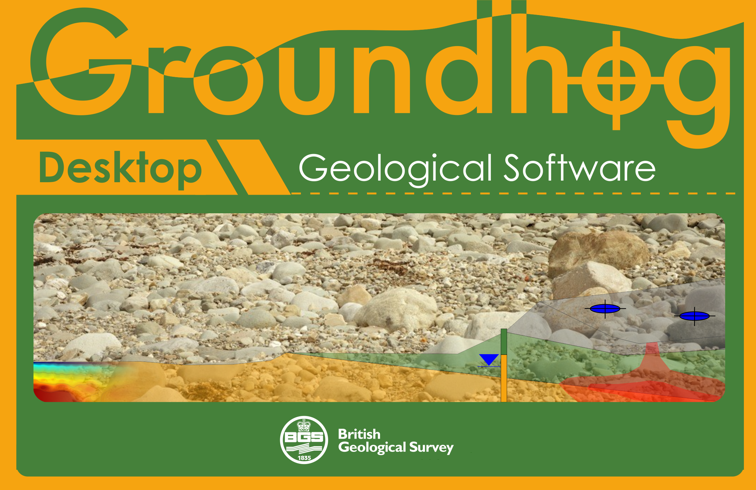
.. |image1| image:: media/image2.png
   :width: 4.11434in
   :height: 0.71736in
.. |image2| image:: media/image3.gif
   :width: 0.71736in
   :height: 0.71736in
.. |image3| image:: media/image2.png
   :width: 2.05356in
   :height: 0.6017in
.. |image4| image:: media/image4.jpeg
   :width: 6.26806in
   :height: 4.17847in
.. |image5| image:: media/image5.png
   :width: 4.94783in
   :height: 2.88121in
.. |image6| image:: media/image6.png
   :width: 5.4375in
   :height: 2.91667in
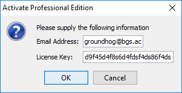
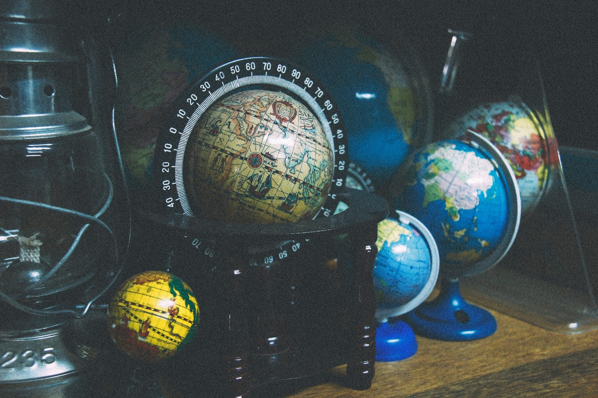
.. |image9| image:: media/image9.png
   :width: 1.96099in
   :height: 5.11304in
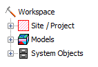
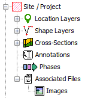
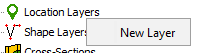
.. |image13| image:: media/image13.png
   :width: 2.36522in
   :height: 1.09302in
.. |image14| image:: media/image14.png
   :width: 2.63478in
   :height: 1.09315in
.. |image15| image:: media/image15.png
   :width: 1.58333in
   :height: 0.63542in
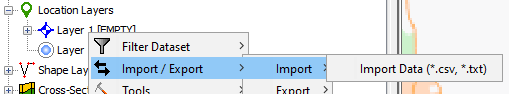
.. |image17| image:: media/image17.png
   :width: 1.83333in
   :height: 0.5625in
.. |image18| image:: media/image18.png
   :width: 2.53044in
   :height: 1.16937in
.. |image19| image:: media/image19.png
   :width: 2.10417in
   :height: 0.47917in
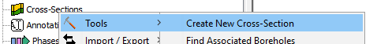
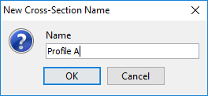
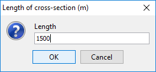
.. |image23| image:: media/image23.png
   :width: 1.33333in
   :height: 0.44792in
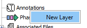
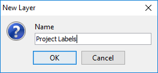
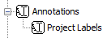
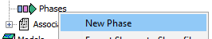
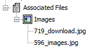
.. |image29| image:: media/image29.png
   :width: 1.57292in
   :height: 0.875in
.. |image30| image:: media/image30.png
   :width: 1.83333in
   :height: 0.98958in
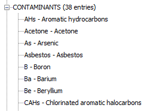
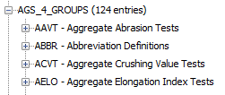
.. |image33| image:: media/image33.png
   :width: 2.03125in
   :height: 0.58333in
.. |image34| image:: media/image34.png
   :width: 2.41739in
   :height: 1.11713in
.. |image35| image:: media/image35.png
   :width: 1.83333in
   :height: 0.32292in
.. |image36| image:: media/image36.jpeg
   :width: 6.26806in
   :height: 4.17847in
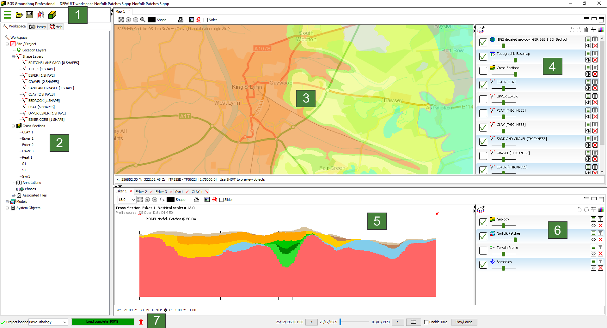

.. |image39| image:: media/image39.png
   :width: 0.39583in
   :height: 0.39583in
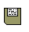
.. |image41| image:: media/image41.png
   :width: 0.39583in
   :height: 0.41667in
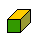

.. |image44| image:: media/image39.png
   :width: 0.39583in
   :height: 0.39583in

.. |image46| image:: media/image41.png
   :width: 0.39583in
   :height: 0.41667in

.. |image49| image:: media/image39.png
   :width: 0.39583in
   :height: 0.39583in

.. |image51| image:: media/image41.png
   :width: 0.39583in
   :height: 0.41667in

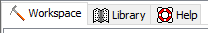
.. |image54| image:: media/image44.png
   :width: 0.86567in
   :height: 0.2929in
.. |image55| image:: media/image45.png
   :width: 3.18657in
   :height: 2.40134in
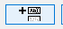
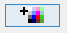
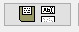
.. |image59| image:: media/image49.png
   :width: 0.84375in
   :height: 0.35417in

.. |image63| image:: media/image49.png
   :width: 0.84375in
   :height: 0.35417in

.. |image67| image:: media/image49.png
   :width: 0.84375in
   :height: 0.35417in
.. |image68| image:: media/image50.png
   :width: 6.26806in
   :height: 4.19861in
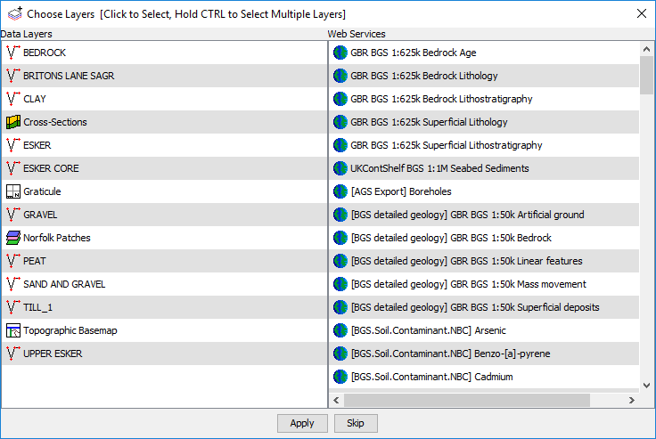
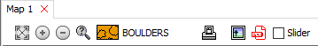

.. |image72| image:: media/image54.png
   :width: 0.27083in
   :height: 0.27083in

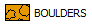
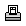
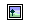
.. |image78| image:: media/image60.png
   :width: 0.26042in
   :height: 0.26042in
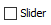
.. |image80| image:: media/image62.png
   :width: 3.63433in
   :height: 1.75101in

.. |image82| image:: media/image54.png
   :width: 0.27083in
   :height: 0.27083in

.. |image88| image:: media/image60.png
   :width: 0.26042in
   :height: 0.26042in

.. |image90| image:: media/image62.png
   :width: 3.63433in
   :height: 1.75101in

.. |image92| image:: media/image54.png
   :width: 0.27083in
   :height: 0.27083in

.. |image98| image:: media/image60.png
   :width: 0.26042in
   :height: 0.26042in

.. |image100| image:: media/image62.png
   :width: 3.63433in
   :height: 1.75101in
.. |image101| image:: media/image63.png
   :width: 1.70833in
   :height: 1.17708in
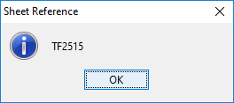

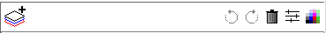
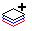
.. |image107| image:: media/image67.png
   :width: 0.26042in
   :height: 0.28125in

.. |image110| image:: media/image70.png
   :width: 0.25in
   :height: 0.27083in
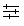

.. |image113| image:: media/image67.png
   :width: 0.26042in
   :height: 0.28125in

.. |image116| image:: media/image70.png
   :width: 0.25in
   :height: 0.27083in

.. |image119| image:: media/image67.png
   :width: 0.26042in
   :height: 0.28125in

.. |image122| image:: media/image70.png
   :width: 0.25in
   :height: 0.27083in

.. |image124| image:: media/image72.png
   :width: 3.77083in
   :height: 1.44792in
.. |image125| image:: media/image73.png
   :width: 1.91667in
   :height: 1.05208in
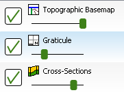

.. |image128| image:: media/image76.png
   :width: 3.83333in
   :height: 1.40625in
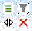
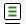
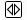
.. |image132| image:: media/image80.png
   :width: 0.23958in
   :height: 0.23958in
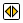
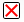

.. |image137| image:: media/image80.png
   :width: 0.23958in
   :height: 0.23958in

.. |image142| image:: media/image80.png
   :width: 0.23958in
   :height: 0.23958in

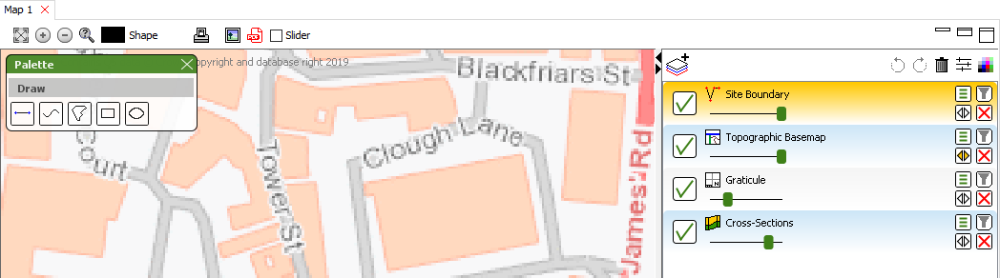
.. |image147| image:: media/image85.png
   :width: 3.15672in
   :height: 1.71587in
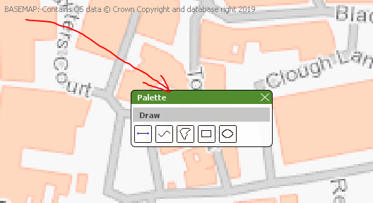
.. |image149| image:: media/image87.png
   :width: 4.22917in
   :height: 0.58333in
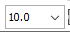

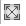
.. |image153| image:: media/image91.png
   :width: 0.30208in
   :height: 0.28125in
.. |image154| image:: media/image92.png
   :width: 0.28125in
   :height: 0.30208in
.. |image155| image:: media/image93.png
   :width: 0.75in
   :height: 0.29167in

.. |image158| image:: media/image60.png
   :width: 0.26042in
   :height: 0.26042in

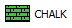

.. |image164| image:: media/image91.png
   :width: 0.30208in
   :height: 0.28125in
.. |image165| image:: media/image92.png
   :width: 0.28125in
   :height: 0.30208in
.. |image166| image:: media/image93.png
   :width: 0.75in
   :height: 0.29167in

.. |image169| image:: media/image60.png
   :width: 0.26042in
   :height: 0.26042in

.. |image175| image:: media/image91.png
   :width: 0.30208in
   :height: 0.28125in
.. |image176| image:: media/image92.png
   :width: 0.28125in
   :height: 0.30208in
.. |image177| image:: media/image93.png
   :width: 0.75in
   :height: 0.29167in

.. |image180| image:: media/image60.png
   :width: 0.26042in
   :height: 0.26042in

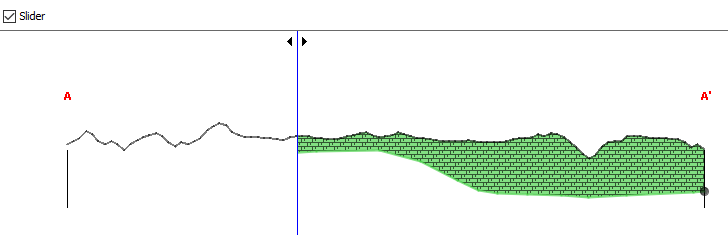
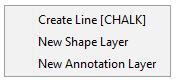

.. |image186| image:: media/image67.png
   :width: 0.26042in
   :height: 0.28125in

.. |image188| image:: media/image70.png
   :width: 0.25in
   :height: 0.27083in

.. |image191| image:: media/image67.png
   :width: 0.26042in
   :height: 0.28125in

.. |image193| image:: media/image70.png
   :width: 0.25in
   :height: 0.27083in

.. |image196| image:: media/image67.png
   :width: 0.26042in
   :height: 0.28125in

.. |image198| image:: media/image70.png
   :width: 0.25in
   :height: 0.27083in

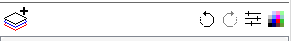
.. |image201| image:: media/image98.png
   :width: 1.61458in
   :height: 0.96875in
.. |image202| image:: media/image99.png
   :width: 1.35075in
   :height: 1.57449in
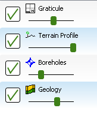
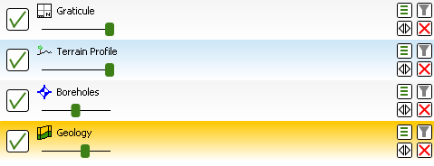

.. |image208| image:: media/image80.png
   :width: 0.23958in
   :height: 0.23958in

.. |image213| image:: media/image80.png
   :width: 0.23958in
   :height: 0.23958in

.. |image218| image:: media/image80.png
   :width: 0.23958in
   :height: 0.23958in

.. |image224| image:: media/image105.png
   :width: 1.98958in
   :height: 1.76042in
.. |image225| image:: media/image106.png
   :width: 2.21875in
   :height: 0.375in

.. |image230| image:: media/image111.png
   :width: 3.42609in
   :height: 2.41743in
.. |image231| image:: media/image112.png
   :width: 6.26806in
   :height: 3.09931in
.. |image232| image:: media/image113.png
   :width: 3.39583in
   :height: 2.40625in
.. |image233| image:: media/image114.png
   :width: 3.95833in
   :height: 1.33333in
.. |image234| image:: media/image115.png
   :width: 4.2in
   :height: 2.10363in

.. |image236| image:: media/image117.png
   :width: 6.26806in
   :height: 4.57917in

.. |image240| image:: media/image121.png
   :width: 5.10417in
   :height: 1.1875in

.. |image253| image:: media/image134.png
   :width: 5.53125in
   :height: 1.57292in
.. |image254| image:: media/image135.png
   :width: 6.26806in
   :height: 1.39306in

.. |image256| image:: media/image137.png
   :width: 6.26806in
   :height: 2.59861in
.. |image257| image:: media/image138.png
   :width: 2.11458in
   :height: 0.89583in

.. |image259| image:: media/image134.png
   :width: 5.53125in
   :height: 1.57292in
.. |image260| image:: media/image140.png
   :width: 6.26806in
   :height: 0.97639in

.. |image262| image:: media/image142.png
   :width: 2.26087in
   :height: 0.89138in
.. |image263| image:: media/image143.png
   :width: 6.26806in
   :height: 2.25903in
.. |image264| image:: media/image144.png
   :width: 3.41667in
   :height: 1.32292in

.. |image266| image:: media/image146.png
   :width: 2.75in
   :height: 1.21875in

.. |image276| image:: media/image156.png
   :width: 5.0625in
   :height: 1.625in
.. |image277| image:: media/image157.png
   :width: 2.88542in
   :height: 0.70833in
.. |image278| image:: media/image158.png
   :width: 2.85417in
   :height: 1.29167in
.. |image279| image:: media/image159.jpeg
   :width: 6.26806in
   :height: 4.17847in

.. |image287| image:: media/image167.png
   :width: 2.3806in
   :height: 1.10012in

.. |image292| image:: media/image172.png
   :width: 3.32836in
   :height: 1.95586in

.. |image294| image:: media/image174.png
   :width: 4.66956in
   :height: 1.78797in

.. |image296| image:: media/image176.png
   :width: 6.26806in
   :height: 1.80347in

.. |image298| image:: media/image178.png
   :width: 4.87826in
   :height: 1.15633in

.. |image311| image:: media/image191.png
   :width: 3.6087in
   :height: 2.92859in

.. |image333| image:: media/image213.png
   :width: 3.93044in
   :height: 1.7347in

.. |image354| image:: media/image233.png
   :width: 2.39583in
   :height: 1.60417in

.. |image358| image:: media/image237.png
   :width: 1.91523in
   :height: 2.53913in

.. |image361| image:: media/image240.png
   :width: 3.44821in
   :height: 2.87826in

.. |image363| image:: media/image242.png
   :width: 3.67826in
   :height: 3.04279in

.. |image365| image:: media/image244.jpeg
   :width: 6.26806in
   :height: 4.70139in

.. |image367| image:: media/image246.png
   :width: 4.88696in
   :height: 1.68764in
.. |image368| image:: media/image247.png
   :width: 2.37391in
   :height: 1.09704in
.. |image369| image:: media/image248.png
   :width: 4.47826in
   :height: 1.54634in

.. |image372| image:: media/image251.png
   :width: 4.03125in
   :height: 2.53125in
.. |image373| image:: media/image252.png
   :width: 3.84375in
   :height: 2.23958in
.. |image374| image:: media/image253.png
   :width: 5.61739in
   :height: 0.81715in
.. |image375| image:: media/image254.png
   :width: 2.63542in
   :height: 1.20833in

.. |image380| image:: media/image253.png
   :width: 5.61739in
   :height: 0.81715in

.. |image382| image:: media/image260.png
   :width: 2.38261in
   :height: 1.75604in
.. |image383| image:: media/image261.png
   :width: 3.47917in
   :height: 1.5in

.. |image388| image:: media/image266.png
   :width: 2.29167in
   :height: 1in

.. |image390| image:: media/image268.png
   :width: 4.14878in
   :height: 3.07826in

.. |image395| image:: media/image273.png
   :width: 5.36458in
   :height: 0.72917in

.. |image398| image:: media/image276.png
   :width: 2.98261in
   :height: 1.11944in
.. |image399| image:: media/image277.png
   :width: 3.02609in
   :height: 1.20722in

.. |image401| image:: media/image279.png
   :width: 4.22609in
   :height: 3.03523in
.. |image402| image:: media/image280.png
   :width: 2.75in
   :height: 1.27083in
.. |image403| image:: media/image281.png
   :width: 3.07826in
   :height: 2.36311in
.. |image404| image:: media/image282.png
   :width: 5.15652in
   :height: 1.92984in
.. |image405| image:: media/image283.png
   :width: 2.25217in
   :height: 1.04078in

.. |image408| image:: media/image286.png
   :width: 0.32292in
   :height: 0.34375in
.. |image409| image:: media/image287.png
   :width: 0.33333in
   :height: 0.30208in

.. |image414| image:: media/image292.png
   :width: 4.30208in
   :height: 1.79167in
.. |image415| image:: media/image293.png
   :width: 2.65625in
   :height: 1.38542in

.. |image417| image:: media/image295.png
   :width: 2.32292in
   :height: 1in

.. |image420| image:: media/image298.png
   :width: 4.3125in
   :height: 1.98958in

.. |image423| image:: media/image301.png
   :width: 2.22917in
   :height: 0.98958in
.. |image424| image:: media/image302.png
   :width: 6.03125in
   :height: 1.86458in

.. |cid:56bf7827-d83e-41d9-a893-ba263016cf41| image:: media/image309.jpeg
   :width: 1.73194in
   :height: 2.88611in

.. |image436| image:: media/image314.png
   :width: 4.9375in
   :height: 1.44792in

.. |image439| image:: media/image317.png
   :width: 5.1875in
   :height: 1.41667in
.. |image440| image:: media/image318.png
   :width: 2.3209in
   :height: 0.92007in
.. |image441| image:: media/image319.png
   :width: 2.27612in
   :height: 1.10262in

.. |image443| image:: media/image321.png
   :width: 2.83582in
   :height: 1.21963in

.. |image445| image:: media/image323.png
   :width: 4.31343in
   :height: 1.72136in

.. |image448| image:: media/image326.png
   :width: 4.28358in
   :height: 2.54376in
.. |image449| image:: media/image321.png
   :width: 2.83582in
   :height: 1.21963in

.. |image453| image:: media/image330.png
   :width: 4.16418in
   :height: 1.83896in
.. |image454| image:: media/image331.png
   :width: 4.35211in
   :height: 2.28358in

.. |image457| image:: media/image334.png
   :width: 4.11194in
   :height: 2.29879in

.. |image462| image:: media/image339.png
   :width: 4.0597in
   :height: 2.11653in

.. |image466| image:: media/image343.png
   :width: 4.35417in
   :height: 2.28125in

.. |image470| image:: media/image347.png
   :width: 6.26806in
   :height: 2.38194in
.. |image471| image:: media/image348.png
   :width: 4.4375in
   :height: 1.52083in

.. |image473| image:: media/image350.png
   :width: 4.4087in
   :height: 2.00321in

.. |image475| image:: media/image352.png
   :width: 6.26806in
   :height: 2.39583in
.. |image476| image:: media/image353.png
   :width: 5.07826in
   :height: 2.46543in

.. |image478| image:: media/image355.png
   :width: 4.76119in
   :height: 2.12054in

.. |image480| image:: media/image357.png
   :width: 3.18657in
   :height: 1.77434in

.. |image484| image:: media/image361.png
   :width: 6.26806in
   :height: 2.59583in
.. |image485| image:: media/image362.png
   :width: 2.16667in
   :height: 0.95833in

.. |image489| image:: media/image366.png
   :width: 1.24627in
   :height: 0.70841in

.. |image492| image:: media/image369.png
   :width: 6.26806in
   :height: 1.83125in

.. |image494| image:: media/image371.png
   :width: 6.26806in
   :height: 2.34028in

.. |image496| image:: media/image373.png
   :width: 3.07463in
   :height: 2.0791in

.. |image499| image:: media/image376.png
   :width: 2.73134in
   :height: 0.98632in
.. |image500| image:: media/image377.png
   :width: 2.26866in
   :height: 1.04839in
.. |image501| image:: media/image378.png
   :width: 6.26806in
   :height: 2.35278in

.. |image510| image:: media/image386.png
   :width: 1.9375in
   :height: 1.08333in

.. |image531| image:: media/image407.png
   :width: 0.21875in
   :height: 0.26042in

.. |image533| image:: media/image409.png
   :width: 0.25in
   :height: 0.22917in
.. |image534| image:: media/image410.png
   :width: 0.26042in
   :height: 0.22917in

.. |image536| image:: media/image407.png
   :width: 0.21875in
   :height: 0.26042in

.. |image538| image:: media/image409.png
   :width: 0.25in
   :height: 0.22917in
.. |image539| image:: media/image410.png
   :width: 0.26042in
   :height: 0.22917in

.. |image541| image:: media/image407.png
   :width: 0.21875in
   :height: 0.26042in

.. |image543| image:: media/image409.png
   :width: 0.25in
   :height: 0.22917in
.. |image544| image:: media/image410.png
   :width: 0.26042in
   :height: 0.22917in

.. |image547| image:: media/image413.png
   :width: 5.90625in
   :height: 4.19792in
.. |image548| image:: media/image414.png
   :width: 3.85217in
   :height: 2.82493in
.. |image549| image:: media/image415.png
   :width: 3.97917in
   :height: 1.10417in

.. |image552| image:: media/image418.png
   :width: 4.50435in
   :height: 1.36754in

.. |image555| image:: media/image421.png
   :width: 3.04167in
   :height: 0.6875in

.. |image557| image:: media/image423.png
   :width: 2.75in
   :height: 1.27083in
.. |image558| image:: media/image424.png
   :width: 6.26806in
   :height: 1.38403in

.. |image565| image:: media/image431.png
   :width: 6.26806in
   :height: 1.37361in

.. |image569| image:: media/image435.png
   :width: 3.4818in
   :height: 3.46087in
.. |image570| image:: media/image436.png
   :width: 6.26806in
   :height: 4.38611in

.. |image572| image:: media/image438.png
   :width: 2.54545in
   :height: 1.92in

.. |image574| image:: media/image440.png
   :width: 1.875in
   :height: 0.6875in
.. |image575| image:: media/image441.png
   :width: 3.46104in
   :height: 1.27736in
.. |image576| image:: media/image442.png
   :width: 3.41558in
   :height: 2.06099in
.. |image577| image:: media/image443.png
   :width: 3.21875in
   :height: 1.11458in
.. |image578| image:: media/image444.png
   :width: 4.11039in
   :height: 1.48328in
.. |image579| image:: media/image445.png
   :width: 4.77273in
   :height: 3.72734in

.. |image581| image:: media/image447.png
   :width: 2.08442in
   :height: 0.96325in
.. |image582| image:: media/image448.png
   :width: 6.26806in
   :height: 2.88542in

.. |image584| image:: media/image450.png
   :width: 4.30519in
   :height: 2.42829in
.. |image585| image:: media/image451.png
   :width: 2.48052in
   :height: 1.07569in
.. |image586| image:: media/image452.png
   :width: 3.92208in
   :height: 1.91825in

.. |image588| image:: media/image454.png
   :width: 4.1039in
   :height: 2.1979in

.. |image590| image:: media/image456.png
   :width: 2.41558in
   :height: 1.23397in
.. |image591| image:: media/image457.png
   :width: 3.30519in
   :height: 1.17013in

.. |image594| image:: media/image460.png
   :width: 4.11039in
   :height: 2.82845in

.. |image596| image:: media/image462.png
   :width: 4.03896in
   :height: 2.25486in

.. |image605| image:: media/image471.png
   :width: 6.26806in
   :height: 1.56458in
.. |image606| image:: media/image472.png
   :width: 4.34416in
   :height: 2.65818in
.. |image607| image:: media/image473.png
   :width: 4.57792in
   :height: 3.7933in
.. |image608| image:: media/image474.png
   :width: 3.96526in
   :height: 2.25325in

.. |image610| image:: media/image476.png
   :width: 3.2013in
   :height: 1.72481in

.. |image612| image:: media/image478.png
   :width: 2.09091in
   :height: 0.96625in

.. |image614| image:: media/image480.png
   :width: 3.69481in
   :height: 1.37931in

.. |image621| image:: media/image487.png
   :width: 4.07792in
   :height: 1.73775in

.. |image627| image:: media/image493.png
   :width: 2.97336in
   :height: 3.6039in

.. |image629| image:: media/image495.png
   :width: 3.06494in
   :height: 3.48025in

.. |image633| image:: media/image499.png
   :width: 2.86214in
   :height: 3.38312in

.. |image636| image:: media/image502.png
   :width: 5.10585in
   :height: 2.7in

.. |image642| image:: media/image508.png
   :width: 4.76585in
   :height: 3.69792in

.. |image653| image:: media/image517.png
   :width: 6.05208in
   :height: 4.66473in

.. |image664| image:: media/image527.png
   :width: 4.17708in
   :height: 2.35049in

